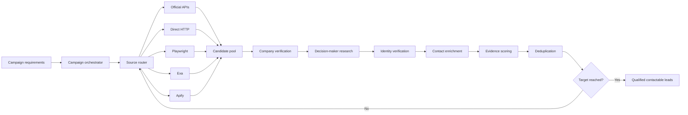

# AI Lead Scout

**Category:** AI Agent / Research Automation / Lead Intelligence  
**Status:** Active development  
**Source code:** Private

## Overview

AI Lead Scout is a campaign-oriented research agent built to deliver genuinely qualified, current, contactable leads. The system is designed around campaign outcomes rather than simply completing a search stage or returning a list of names.

A campaign keeps working across sources and batches until it reaches the requested number of qualified leads or exhausts the available sources.

## The problem

Many lead generation tools stop after discovery. They may return companies, profiles, or contact records, but the user still has to answer the important questions manually:

- Is the company actually active?
- Is it relevant to the campaign?
- Is the person really the right decision-maker?
- Is the identity match reliable?
- Is there a usable contact path?
- Is there enough evidence to justify outreach?

AI Lead Scout moves those checks into the research pipeline.

## Architecture

## System design

The agent is structured around a campaign orchestrator and source-specific adapters.

Typical flow:

1. Interpret campaign requirements.
2. Select suitable sources.
3. Discover candidate companies or products.
4. Verify that the company is active and relevant.
5. Identify the likely decision-maker.
6. Verify identity with evidence instead of accepting weak name matches.
7. Enrich contact paths such as LinkedIn, email, Instagram, Facebook, phone, or contact forms.
8. Score qualification and evidence quality.
9. Reject weak or unsafe matches.
10. Deduplicate across sources.
11. Continue until the campaign target is reached or source capacity is exhausted.

## Source strategy

The provider strategy favors reliable and low-cost access before expensive fallback methods:

1. Official API or data endpoint
2. Direct HTTP parsing
3. Local browser automation with Playwright
4. Search and enrichment providers such as Exa
5. Proven source-specific Apify Actors
6. Generic scraping providers only when necessary

Cost is treated as part of routing logic. Campaigns can enforce zero incremental spend or require approval before using metered providers.

## Verification philosophy

The system is intentionally conservative around identity and contact data.

A candidate is not considered strong simply because a name appears to match. The agent looks for supporting evidence such as company role, product ownership, profile history, current activity, or other corroborating signals.

False identity matches are rejected instead of being silently passed through as leads.

## Example campaign evidence

A Bubble App Gallery campaign produced 31 unique applications for enrichment. In that run:

- 30 of 31 applications were confirmed active
- 23 had a verified founder or owner
- 21 had a contactable decision-maker
- 23 had a verified LinkedIn path
- 27 were classified as contactable ICP leads
- 24 false identity matches were rejected during verification

The important result is not the raw discovery count. It is the reduction from candidates to evidence-backed, usable leads.

## Quality and testing

The agent includes automated tests around source adapters, capability declarations, campaign behavior, cost policy, enrichment, and verification logic.

A later architecture audit also separated provider capability from incremental cost, so a source marked as technically available cannot silently be treated as free.

## Stack

`TypeScript` `Playwright` `Exa` `Apify` `Web Research` `Automation` `Data Enrichment`

## What this case demonstrates

- Multi-source agent orchestration
- Outcome-based campaign logic
- Source routing and fallback strategies
- Browser automation and scraping
- Decision-maker research
- Evidence-based verification
- Cost-aware execution
- Deduplication and campaign state
- Test-driven agent development

## Public portfolio note

Production source code, provider credentials, private campaign data, and proprietary verification logic are intentionally omitted from this public case study.
