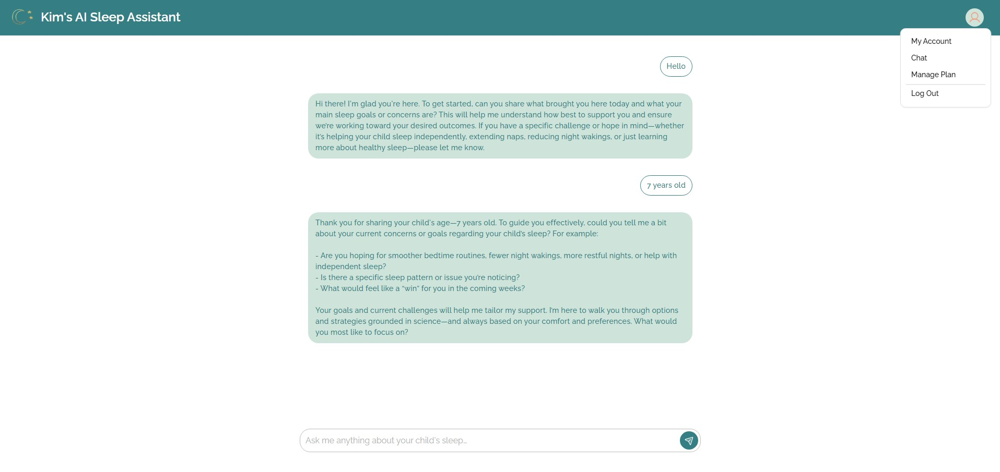
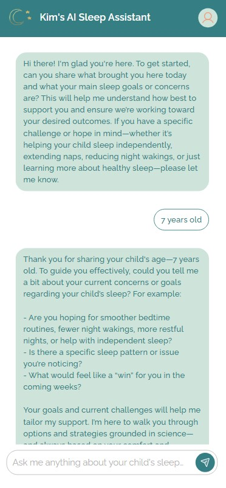
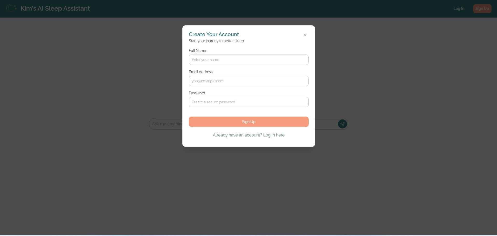
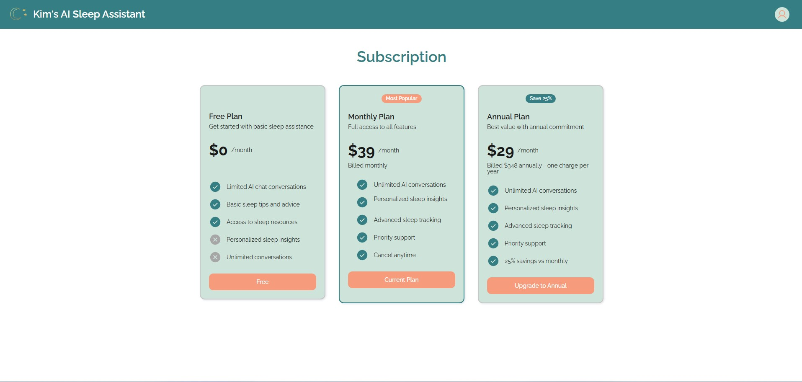
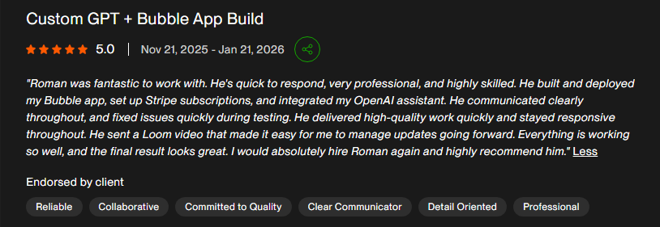

# AI Sleep Assistant

**Category:** AI Product / Client SaaS / Subscription App  
**Live:** https://kim-sleep-assistant-62596.bubbleapps.io/  
**Source code:** Private

## Overview

AI Sleep Assistant is a responsive AI chat product built for a sleep consulting business. The project connected an existing GPT-based assistant to a customer-facing application with free and paid access modes.

The product was built from scratch and delivered as a live client application.

## Screenshots

## Product scope

- Mobile-first chat interface
- Guest access in free mode
- User signup and login
- Free and paid account state
- OpenAI API integration
- Stripe checkout and subscriptions
- Payment-driven subscription status updates
- Account and subscription screens
- Upgrade flows
- Embedded WordPress chat widget
- Admin access for user management
- Documentation and Loom walkthrough

## User flow

The public experience was designed to remove friction:

1. Open the app.
2. Start chatting immediately in free mode.
3. Sign up when the user wants paid functionality.
4. Move directly into subscription selection after signup.
5. Complete Stripe checkout.
6. Update account status after successful payment.
7. Continue with the paid assistant experience.

The WordPress widget was intentionally separate from the full account and subscription flow. It opens a smaller chat experience while authentication and billing stay in the main app.

## Integration work

The application coordinates three external layers:

- OpenAI for assistant responses
- Stripe for payment and subscription state
- WordPress for embedded distribution

The work included aligning subscription flows so payment status updated consistently regardless of where checkout was started.

## Delivery evidence

The application was deployed live after end-to-end testing. The client later confirmed that the live app, Bubble setup, and Stripe flow were working well and left a 5-star review.

> "Roman was fantastic to work with. He's quick to respond, very professional, and highly skilled. He built and deployed my Bubble app, set up Stripe subscriptions, and integrated my OpenAI assistant. He communicated clearly throughout, and fixed issues quickly during testing. He delivered high-quality work quickly and stayed responsive throughout. He sent a Loom video that made it easy for me to manage updates going forward. Everything is working so well, and the final result looks great. I would absolutely hire Roman again and highly recommend him."

## What this case demonstrates

- AI product integration
- Subscription product logic
- Stripe checkout and state synchronization
- Mobile-first chat UX
- Guest-to-paid conversion flows
- Embeddable widgets
- Client delivery and production launch

## Public portfolio note

Private API credentials, assistant instructions, customer data, and production implementation details are intentionally excluded.
