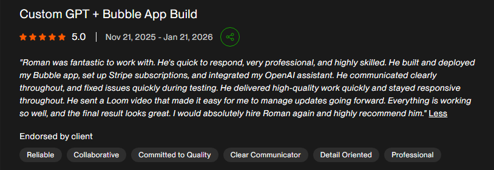

# AI Sleep Assistant

**Category:** AI Product / Client SaaS / Subscription App  
**Live:** https://kim-sleep-assistant-62596.bubbleapps.io/  
**Source code:** Private  
**Work period:** Nov 2025 to Jan 2026  
**Role:** Built the app from scratch and delivered it live: chat interface, OpenAI and Stripe integration, WordPress widget, admin access, and documentation.  
**Problem:** A sleep consulting business needed its existing GPT-based assistant turned into a customer-facing product with free and paid access.  
**Result:** Delivered live after end-to-end testing. The client confirmed the app, Bubble setup, and Stripe flow worked well and left a 5-star review.  
**Metric:** 5.0 | Client rating  

## Overview

AI Sleep Assistant is a responsive AI chat product built for a sleep consulting business.

It connects the client's existing GPT-based assistant to a customer-facing application with free and paid access modes.

## Problem

The client already had a GPT-based sleep assistant. What it lacked was a product around it: a clean chat experience, accounts, paid subscriptions, and a way to offer the assistant on the client's own WordPress site.

## What I built

- Mobile-first chat interface, with guest access in free mode
- Signup and login, with free and paid account states
- OpenAI API integration for the assistant's responses
- Stripe checkout and subscriptions, with payment-driven status updates
- Account and subscription screens, and upgrade flows
- Embedded WordPress chat widget
- Admin access for user management, documentation, and a Loom walkthrough

## Stack and architecture

`Bubble` `OpenAI API` `Stripe` `WordPress`

The app coordinates three external layers:

- OpenAI for the assistant's responses
- Stripe for payment and subscription state
- WordPress for embedded distribution

## Key decisions

- Free mode comes first: users open the app and start chatting immediately, sign up only when they want paid features, then go straight to plan selection and Stripe checkout.
- The widget stays separate from billing: the WordPress widget opens a smaller chat experience, while authentication and subscriptions stay in the main app.
- Subscription state stays consistent: payment status updates the same way regardless of where checkout was started.
- Assistant logic stays with the client: per the client brief, the app passes each message and the user's free or paid status to the GPT and holds no sleep logic of its own.

## Results and evidence

The application was deployed live after end-to-end testing. The client later confirmed that the live app, the Bubble setup, and the Stripe flow were working well, and left a 5-star review.

> "He built and deployed my Bubble app, set up Stripe subscriptions, and integrated my OpenAI assistant."

## Public portfolio note

Private API credentials, assistant instructions, customer data, and production implementation details are intentionally excluded. The interface visuals on this page are presentation mockups, not captures of the live app.
