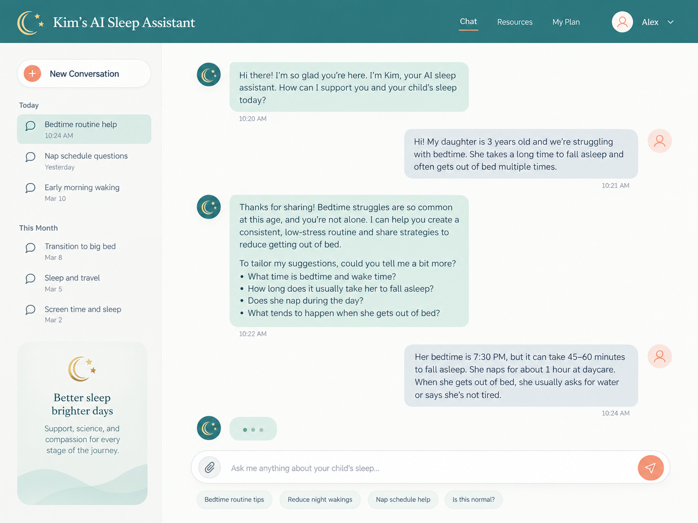
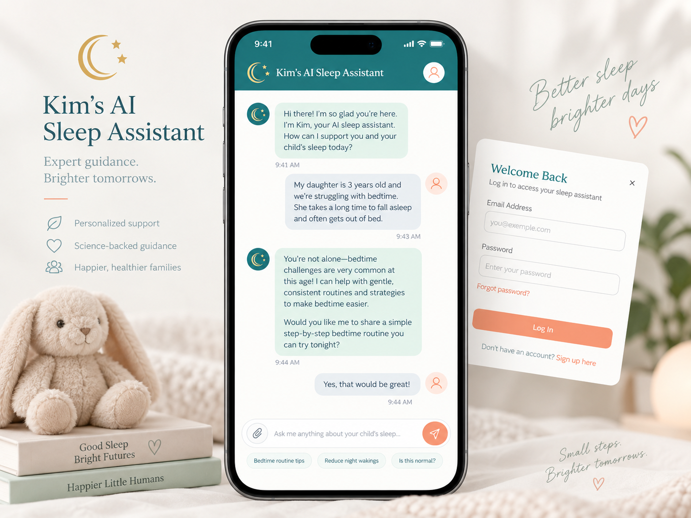
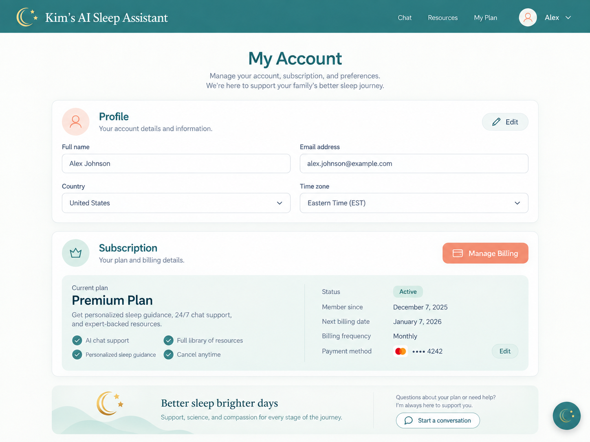
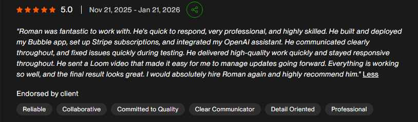
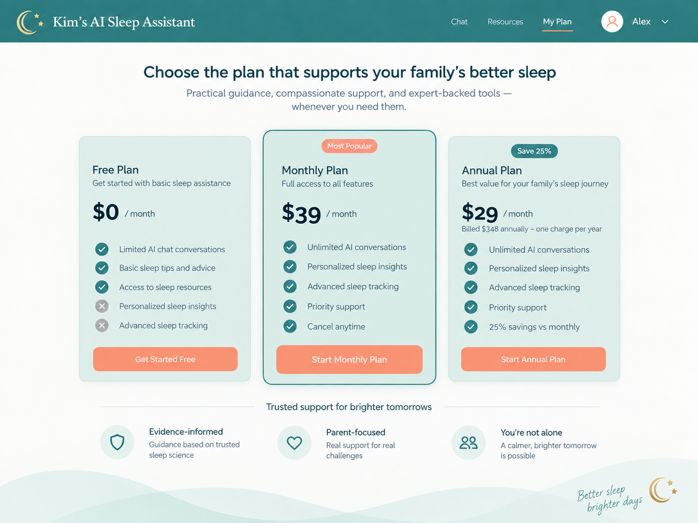

# AI Sleep Assistant

**Category:** AI Product / Client SaaS / Subscription App  
**Live:** https://kim-sleep-assistant-62596.bubbleapps.io/  
**Source code:** Private  
**Work period:** Nov 2025 to Jan 2026  
**Role:** Built the app from scratch and delivered it live: chat interface, OpenAI and Stripe integration, WordPress widget, admin access, and documentation.  
**Problem:** A sleep consulting business needed its existing GPT-based assistant turned into a customer-facing product with free and paid access.  
**Result:** Delivered live after end-to-end testing. The client confirmed the app and the Stripe flow worked well and left a 5-star review.  
**Metric:** 5.0 | Client rating  

## Overview

AI Sleep Assistant is a responsive AI chat product built for a sleep consulting business.

It connects the client's existing GPT-based assistant to a customer-facing application with free and paid access modes.

## Problem & users

The users are customers of a sleep consulting business who chat with its assistant. They are mainly parents asking about a child's sleep. The client already had a GPT-based sleep assistant. What it lacked was a product around it:

- A clean chat experience that works on mobile and desktop.
- Accounts and paid subscriptions, alongside a free mode.
- A way to offer the assistant on the client's own WordPress site.

## My role & ownership

I built the application from scratch and delivered it as a live client application. The areas I owned:

- Mobile-first chat interface, with guest access in free mode
- Signup and login, with free and paid account states
- OpenAI API integration for the assistant's responses
- Stripe checkout and subscriptions, with payment-driven status updates
- Account and subscription screens, and upgrade flows
- Embedded WordPress chat widget
- Admin access for user management, documentation, and a Loom walkthrough

## Product outcomes & evidence

The client later confirmed that the live app and the Stripe flow were working well, and left a 5-star review.

> "He communicated clearly throughout, and fixed issues quickly during testing."

## Product decisions

- Free mode comes first: users open the app and start chatting immediately, sign up only when they want paid features, then go straight to plan selection and Stripe checkout.
- The widget stays separate from billing: the WordPress widget opens a smaller chat experience, while authentication and subscriptions stay in the main app.
- Assistant logic stays with the client: the app passes each message and the user's free or paid status to the client's GPT, which handles the sleep guidance, and holds no sleep logic of its own.

## System & architecture

`OpenAI API` `Stripe` `WordPress`

The application layer is built on Bubble. Around it, the app coordinates three external layers:

- OpenAI for the assistant's responses
- Stripe for payment and subscription state
- WordPress for embedded distribution

## Key challenge

Keeping subscription state consistent wherever checkout starts. The work included aligning subscription flows so payment status updated the same way whether checkout began in the main app or elsewhere.

The public experience was designed to remove friction:

1. Open the app.
2. Start chatting immediately in free mode.
3. Sign up when the user wants paid functionality.
4. Move directly into subscription selection after signup.
5. Complete Stripe checkout.
6. Update account status after successful payment.
7. Continue with the paid assistant experience.

## Validation & production quality

- The application was deployed live after end-to-end testing.
- The client confirmed that the live app and the Stripe flow were working well.
- Documentation and a Loom walkthrough were handed over so the client can manage updates going forward.

## Outcome

AI Sleep Assistant went live as a client application with free and paid access, OpenAI-powered chat, Stripe subscriptions, and an embedded WordPress widget. The client left a 5-star review.

## What this demonstrates

- End-to-end delivery of an AI product, from scope to live launch
- AI product integration with a client-owned assistant
- Subscription logic and Stripe checkout with consistent state
- Mobile-first chat UX and guest-to-paid conversion flows
- Embeddable widgets and client handover

## Public portfolio note

Private API credentials, assistant instructions, customer data, and production implementation details are intentionally excluded. The interface visuals on this page are presentation mockups, not captures of the live app.
