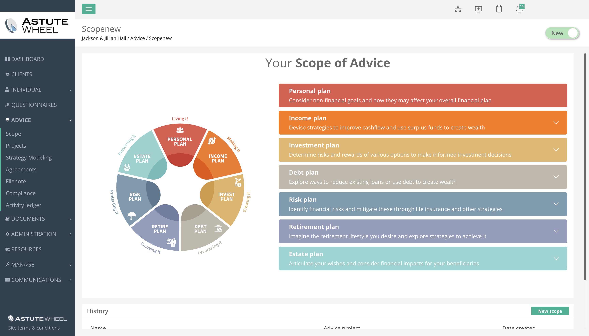
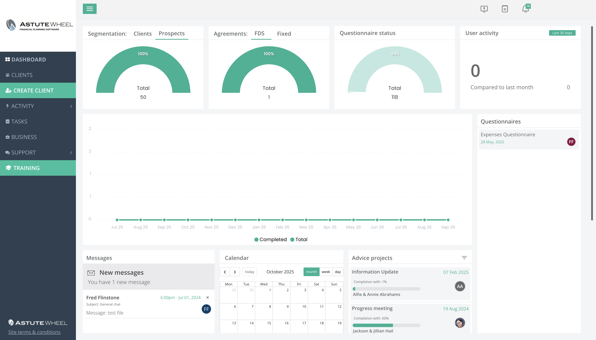
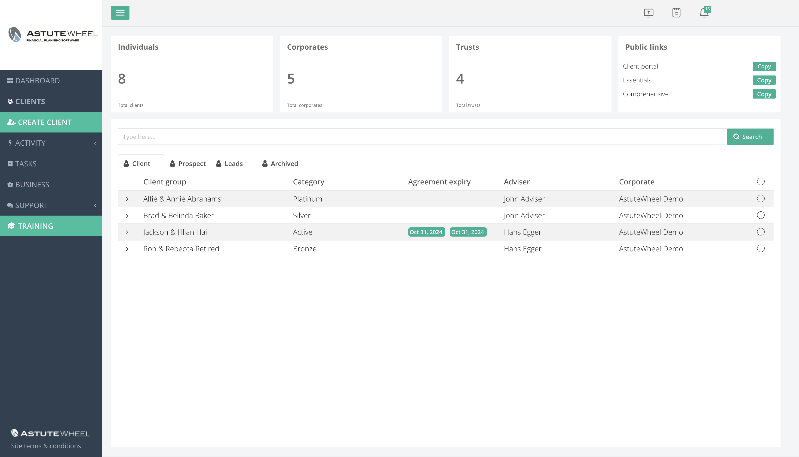
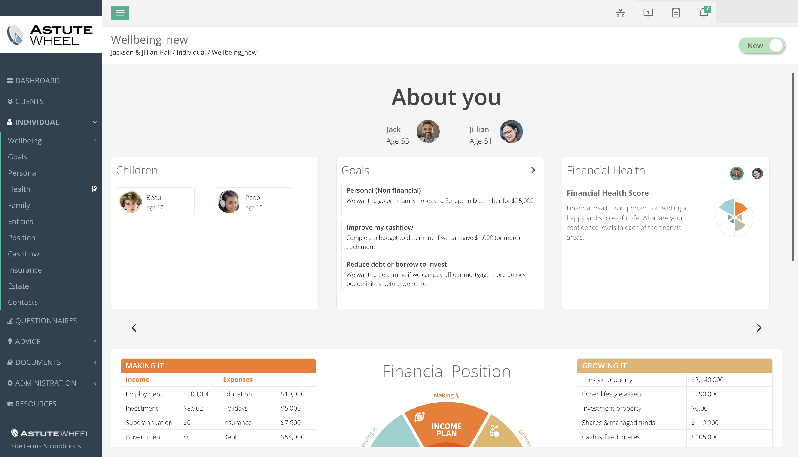
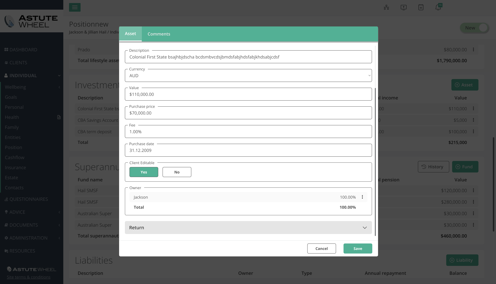
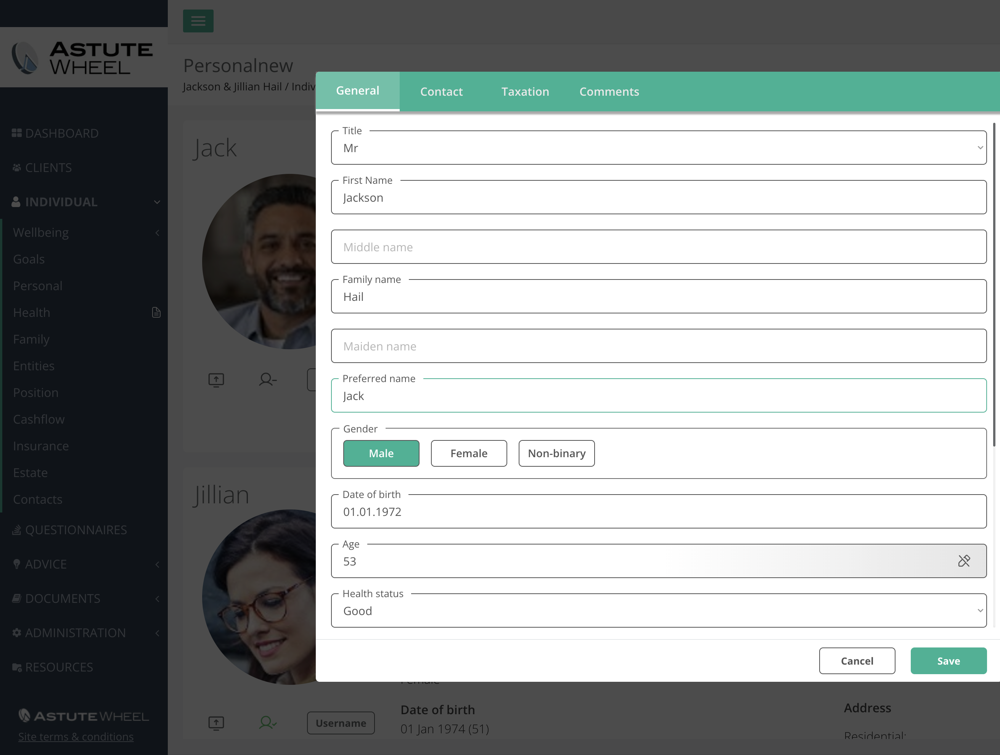
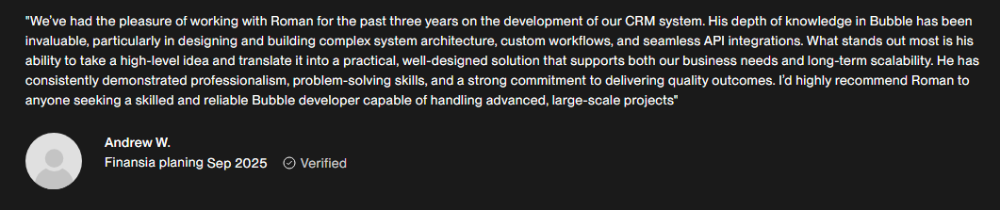

# AstuteWheel

**Category:** Production SaaS / CRM / Financial Planning  
**Scale:** 120k+ users  
**Work period:** Sep 2021 - Present  
**Source code:** Private

## Overview

AstuteWheel is a mature financial planning SaaS and CRM platform used by more than 120,000 users.

My work has gone beyond the UI layer and covers system and database architecture, backend workflows, CRM operations, reporting, integrations, automation, performance optimization, and the ongoing evolution of a large production product.

## Screenshots

## Client feedback

> "We've had the pleasure of working with Roman for the past three years on the development of our CRM system. His depth of knowledge in Bubble has been invaluable, particularly in designing and building complex system architecture, custom workflows, and seamless API integrations. What stands out most is his ability to take a high-level idea and translate it into a practical, well-designed solution that supports both our business needs and long-term scalability. He has consistently demonstrated professionalism, problem-solving skills, and a strong commitment to delivering quality outcomes. I'd highly recommend Roman to anyone seeking a skilled and reliable Bubble developer capable of handling advanced, large-scale projects"
>
> — Andrew W., verified client

## Areas of responsibility

- SaaS and CRM architecture
- Database structure and data relationships
- Backend workflow design and optimization
- Client and operational workflows
- Reporting and dashboards
- Subscription and billing logic
- API integrations
- Automation
- Admin workflows
- Performance optimization
- Long-term product maintenance and evolution

## Integrations

The product work has included integrations and workflows involving services such as:

`Stripe` `DocuSign` `SendGrid` `Zapier` `Make` `n8n` `Airtable` `Google Sheets` `OpenAI` `Supabase`

The exact production implementation and credentials remain private.

## Architecture work

A mature SaaS platform accumulates years of workflows, data relationships, admin processes, reporting requirements, and integrations. Work on a system at this stage is less about adding isolated screens and more about making changes without destabilizing the existing product.

Typical engineering concerns include:

- preserving backwards-compatible behavior
- understanding downstream data effects
- improving slow workflows and heavy queries
- avoiding duplicate business logic
- keeping CRM and reporting data consistent
- integrating external services safely
- evolving features without breaking existing users

## Scale and product context

The platform is used by 120k+ users, so performance, data integrity, maintainability, and operational clarity matter as much as feature delivery.

## What this case demonstrates

- Long-term ownership of a mature SaaS product
- Production architecture under real user scale
- Complex data modeling
- CRM operations
- API and automation integrations
- Reporting and admin systems
- Billing logic
- Performance improvement
- Product rescue and evolution without full rewrites

## Public portfolio note

This is a commercial production system. Source code, internal data, customer information, and proprietary implementation details are intentionally not public.
