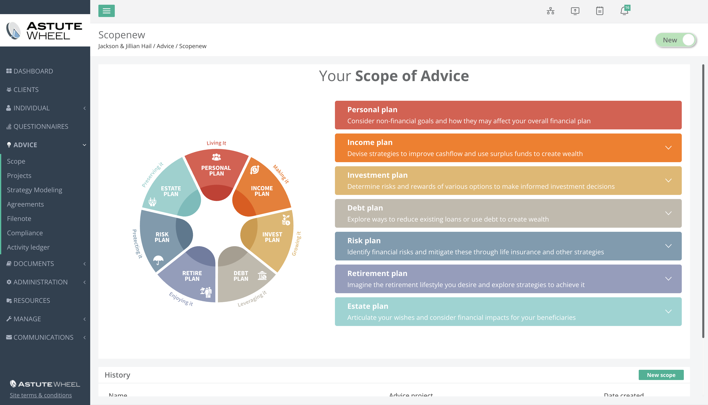
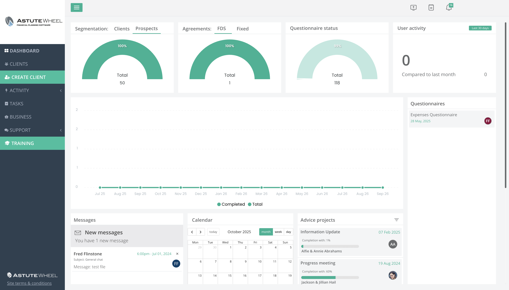
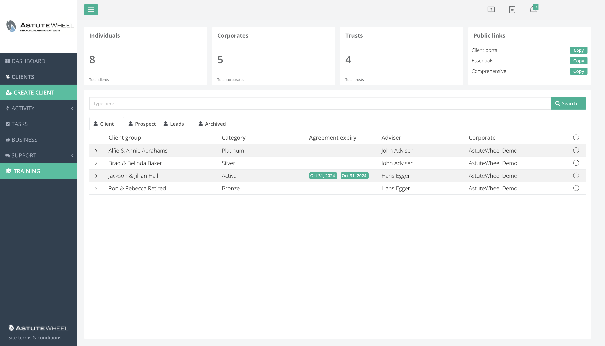
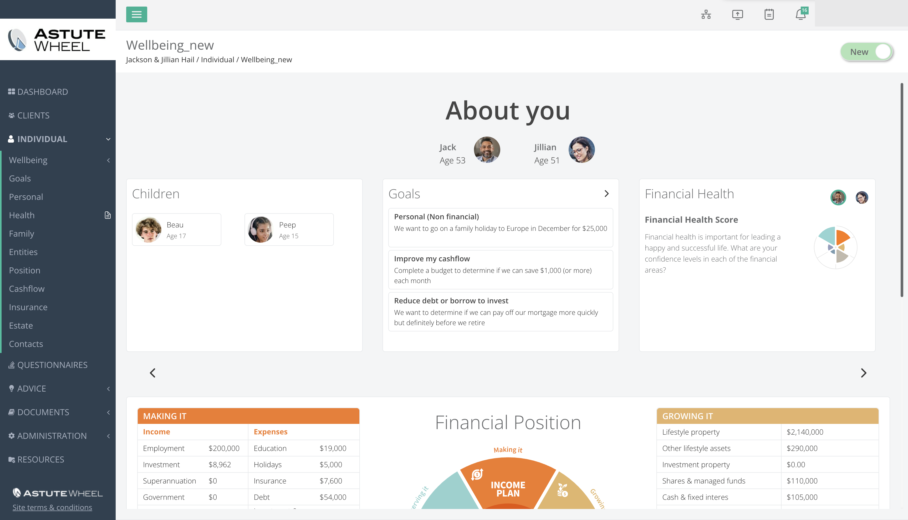
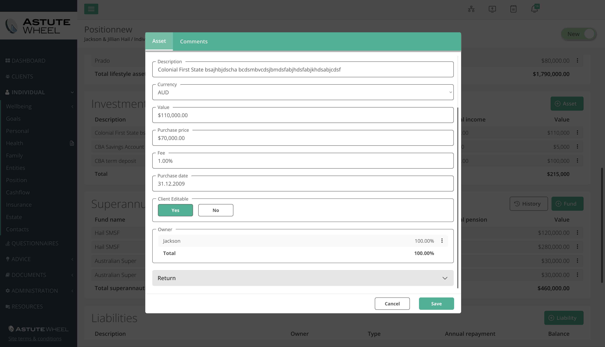
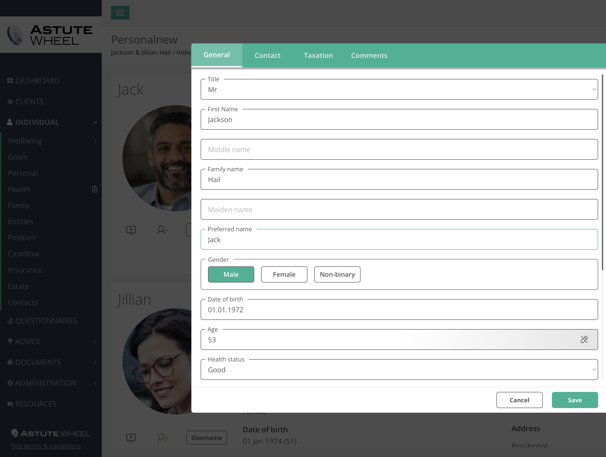
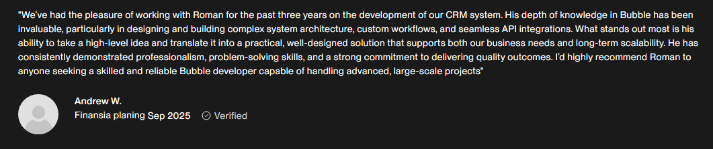

# AstuteWheel

**Category:** Production SaaS / CRM / Financial Planning  
**Status:** Live  
**Live:** https://www.astutewheel.com.au/  
**Badge:** Financial SaaS  
**Source code:** Private  
**Role:** Senior Product Engineer responsible for evolving the product across architecture, data, permissions, financial workflows, integrations, automation, AI features, and production delivery.  
**Problem:** A mature financial-planning SaaS and CRM had to keep evolving while preserving complex customer workflows, financial logic, data integrity, integrations, and production reliability.  
**Result:** A mature production financial platform serving 120k+ active users across financial planning, CRM, reporting, payments, documents, integrations, and automation.  
**Metric:** 120k+ | active users on the platform | product | Product scale  
**Metric:** 10+ | production integrations | evidence | Payments, documents, email, spreadsheets, workflow automation, and AI  

## Overview

AstuteWheel is a mature, live financial-planning SaaS and CRM platform with 120k+ active users, used by financial advice practices for client engagement, advice delivery, and practice management.

As Senior Product Engineer in a small team, I own the architecture, integrations, workflows, permissions, data integrity, and safe production changes that let the platform keep evolving while customers keep working.

- Architecture and the relational data model, with five distinct user roles and their permissions
- Integrations and automation across payments, documents, email, spreadsheets, and workflow tools
- Financial workflows, CRM operations, reporting, and AI-enabled features
- Production delivery, reliability, and safe changes to a live system

## Product outcomes & evidence

Outcomes for the product, and the engineering evidence behind them.

The 120k+ active users are the scale of the platform I help evolve, not a number I claim alone. The 10+ production integrations show the engineering scope: payments, documents, email, spreadsheets, workflow automation, and AI, kept working inside a live system.

## Key product & engineering decisions

- Safe changes in a live system: improvements ship inside the live platform without disrupting existing users, so each change is judged by what it could break as well as what it adds.
- Integration architecture: payments, documents, email, spreadsheets, and automation tools are integrated for each job, and duplicated logic across workflows and integrations is avoided so behavior stays predictable.
- Permissions and access control: five distinct user roles have their own permissions, dashboards, workflows, and data access, governed by explicit permission rules.
- Data consistency and workflow reliability: a relational data model keeps CRM, reporting, and financial data consistent, and new functionality is balanced against the workflows customers already depend on.
- AI where it adds value: OpenAI/ChatGPT powers AI-enabled functionality inside the product.

## System & architecture

`Next.js` `TypeScript` `Supabase` `PostgreSQL` `OpenAI/ChatGPT` `Stripe` `DocuSign` `SendGrid` `Airtable` `Google Sheets` `Zapier` `Make` `n8n`

- Application layer: Next.js and TypeScript, covering financial planning, CRM operations, reporting and dashboards, billing logic, documents, and admin workflows.
- Data layer: Supabase and PostgreSQL, with a relational model for structured financial and business data.
- Permissions and access: five distinct user roles with different permissions, dashboards, workflows, and data access.
- Integrations: Stripe for payments, DocuSign for documents, SendGrid for email, and Airtable and Google Sheets for data exchange.
- Automation and AI: Zapier, Make, and n8n for workflow automation, and OpenAI/ChatGPT for AI-enabled features.
- Production: changes ship into the live platform, with performance, capacity, and troubleshooting part of everyday delivery.

The exact production implementation and credentials remain private.

## Validation & production quality

- Production reliability: performance and capacity work and production support keep a platform of this scale dependable.
- Troubleshooting: production issues are traced to their cause across data, permissions, workflows, and integrations.
- Permissions and data consistency: CRM, reporting, and financial data stay consistent as the product changes, across roles with different access.
- Integration upkeep: more than 10 production integrations are kept working alongside new functionality.
- Database health: database architecture and optimization are part of keeping the platform performant.

## Outcome

AstuteWheel keeps evolving in production without full rewrites, with its workflows, data, and integrations staying consistent for the practices that depend on it.

In the client's words:

> "What stands out most is his ability to take a high-level idea and translate it into a practical, well-designed solution that supports both our business needs and long-term scalability."

> "He has consistently demonstrated professionalism, problem-solving skills, and a strong commitment to delivering quality outcomes."

Andrew W., verified client

Capabilities demonstrated:

- Product decisions in a mature live system
- Evolving architecture without disrupting existing users
- Integration and automation design across payments, documents, email, and spreadsheets
- Permission and data-integrity design
- Production reliability and troubleshooting

## Public portfolio note

This is a commercial production system. Source code, internal data, customer information, and proprietary implementation details are intentionally not public.
