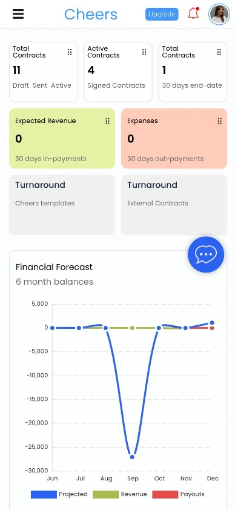

# Cheers

**Category:** Contract Management SaaS
**Source code:** Private

## Overview

Cheers is a workflow-heavy contract management product with analytics, contract pipeline, status tracking, contact CRM, team management, notifications, templates, search, and pagination.

## Key areas

- contract pipeline and status tracking
- CRM and contact management
- analytics dashboard
- team and role-based access
- notifications and templates
- billing, email, and SMS integration hooks
- product and data structure design

## Screenshots

## Public portfolio note

Screens that show specific counterparty names, contact details, or account records are intentionally excluded from this public case study; only aggregate analytics views are shown.
