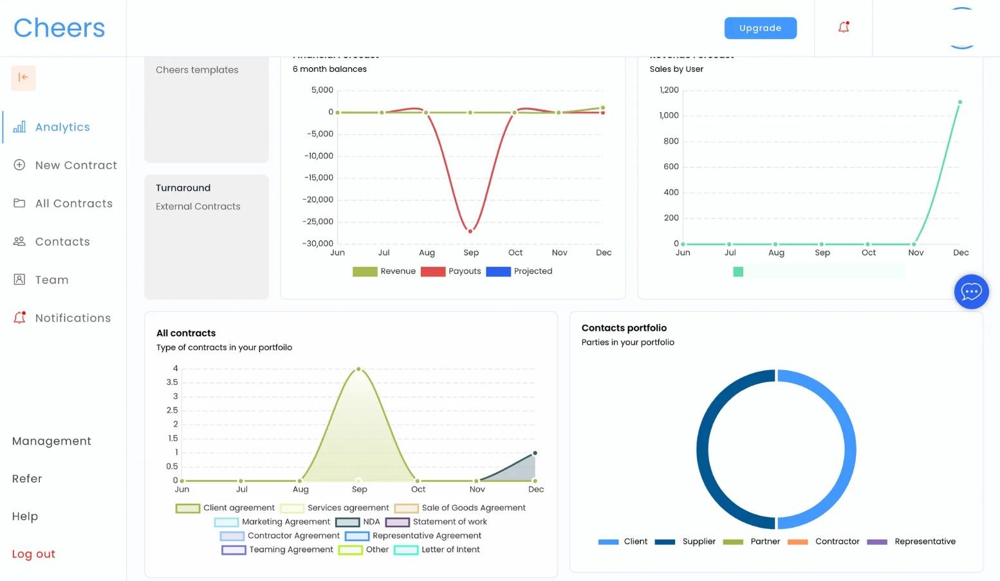
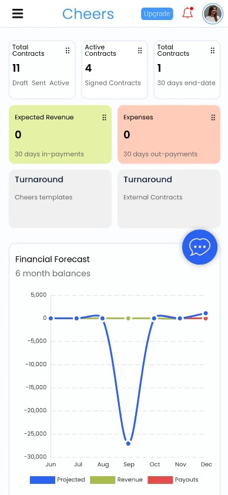

# Cheers

**Category:** Contract Management SaaS  
**Source code:** Private  
**Problem:** Contract work moves through many statuses, contacts, and team members, and needs one place to track it.  
**Result:** A workflow-heavy contract management product with a pipeline, analytics, a contact CRM, and team access control.  

## Overview

Cheers is a workflow-heavy contract management product with analytics, contract pipeline, status tracking, contact CRM, team management, notifications, templates, search, and pagination.

## Problem & users

The users are teams that manage contracts and the contacts behind them. The product covers the full contract workflow: a pipeline with status tracking, a contact CRM, analytics, team management, notifications, and templates.

## System & architecture

- Contract pipeline and status tracking
- CRM and contact management
- Analytics dashboard
- Team and role-based access
- Notifications and templates
- Billing, email, and SMS integration hooks
- Product and data structure design

## What this demonstrates

- Workflow-heavy SaaS design: pipelines, statuses, and role-based access
- Data structure design for contracts and contacts
- Integration hooks for billing, email, and SMS

## Public portfolio note

Screens that show specific counterparty names, contact details, or account records are intentionally excluded from this public case study; only aggregate analytics views are shown.
