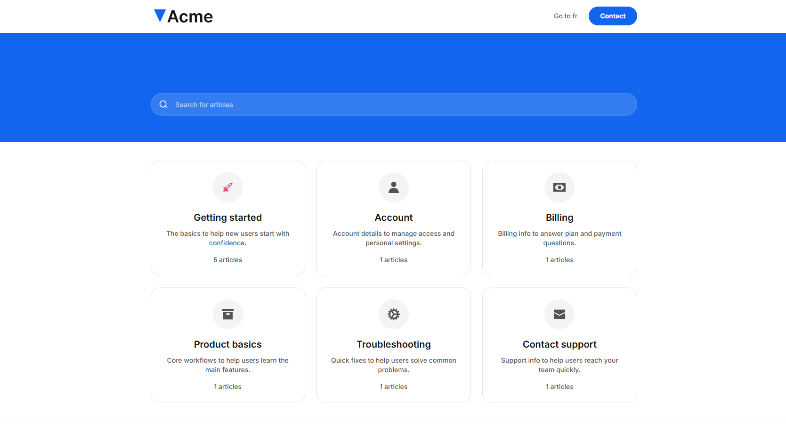
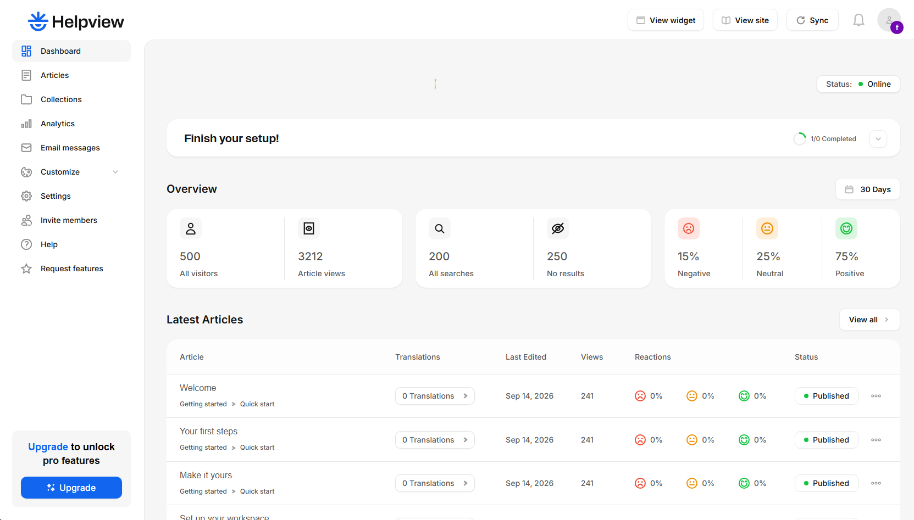
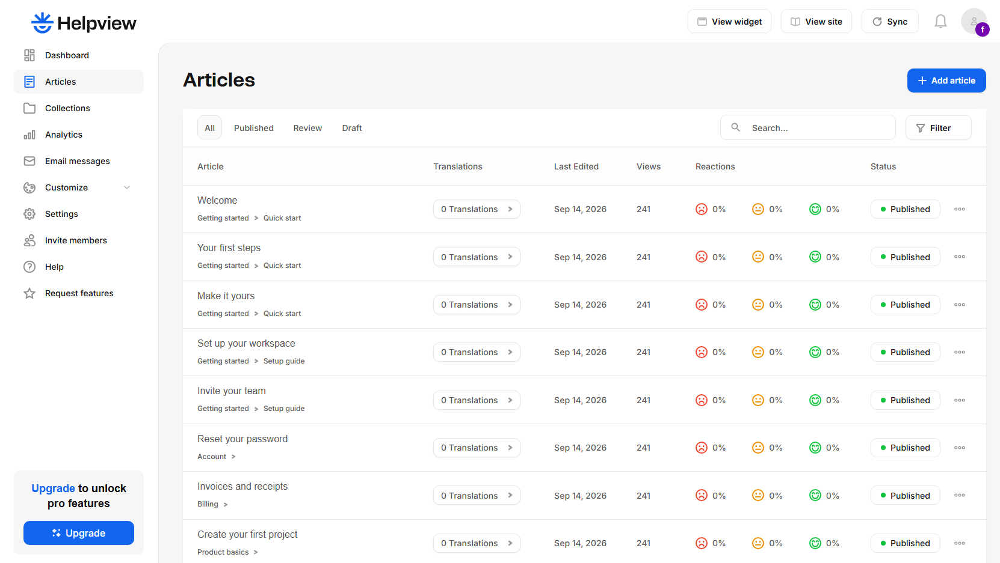
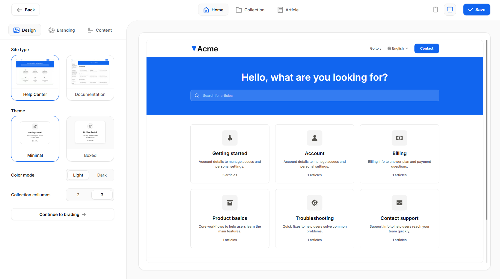
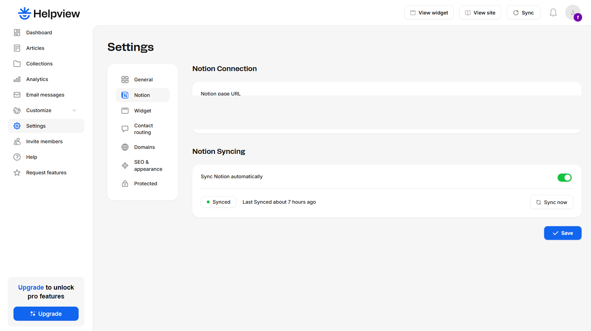
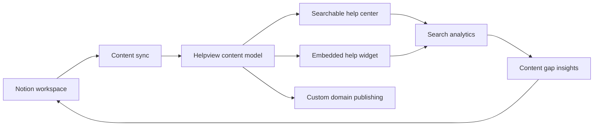

# Helpview

**Category:** SaaS / Knowledge Base / Notion Integration  
**Live:** https://helpview.so/  
**Source code:** Private

## Overview

Helpview turns Notion content into a structured, searchable customer help center. Teams continue writing in Notion while Helpview handles the customer-facing publishing experience.

The product connects one content source to multiple support surfaces such as a help center, documentation, and an embedded help widget.

## Screenshots

## Product flow

## Product capabilities

- Connect a Notion workspace
- Publish Notion pages as customer-facing help content
- Searchable help center
- Help widget
- Theme and brand customization
- Multiple languages
- SEO-friendly publishing
- Custom domains
- Search insights and analytics
- Visibility into zero-result searches and content gaps

## Workflow

1. Connect the Notion workspace.
2. Select and organize help content.
3. Configure the help center style and behavior.
4. Publish to a Helpview subdomain or custom domain.
5. Keep Notion as the editing source.
6. Use search behavior and analytics to improve documentation over time.

## Engineering focus

The product requires coordination across content synchronization, data structure, publishing state, search, theming, permissions, custom domains, analytics, and an embedded support experience.

The implementation uses Bubble for the application layer while the product work focuses on SaaS architecture, workflows, integrations, and user-facing support experiences rather than only page construction.

## What this case demonstrates

- SaaS product development
- Notion integration workflows
- Content synchronization
- Search and knowledge base UX
- Multi-surface publishing
- Customization and theming
- Analytics-driven product feedback
- Embedded widget flows

## Public portfolio note

The production code and internal implementation remain private. Public information in this case study is limited to product behavior and architecture-level work.
