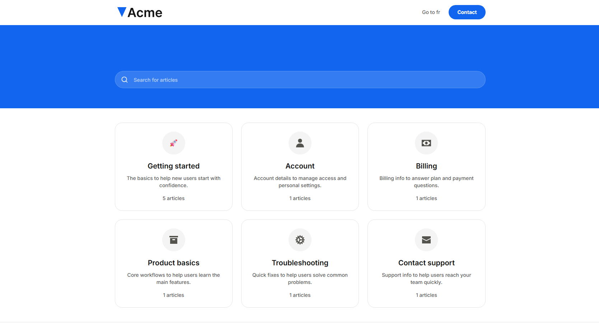
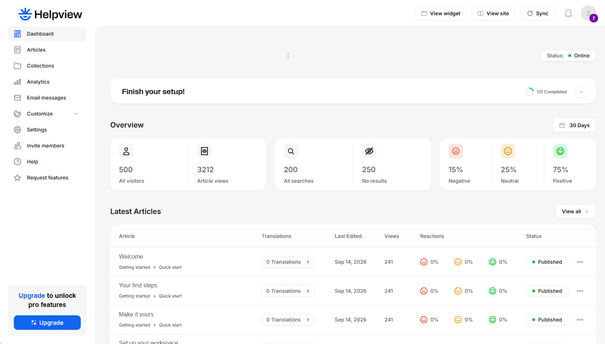
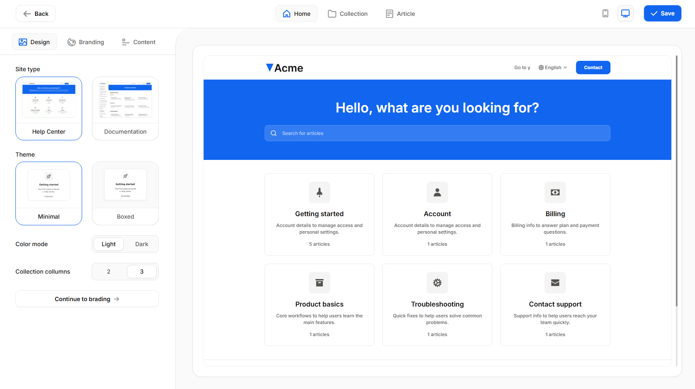
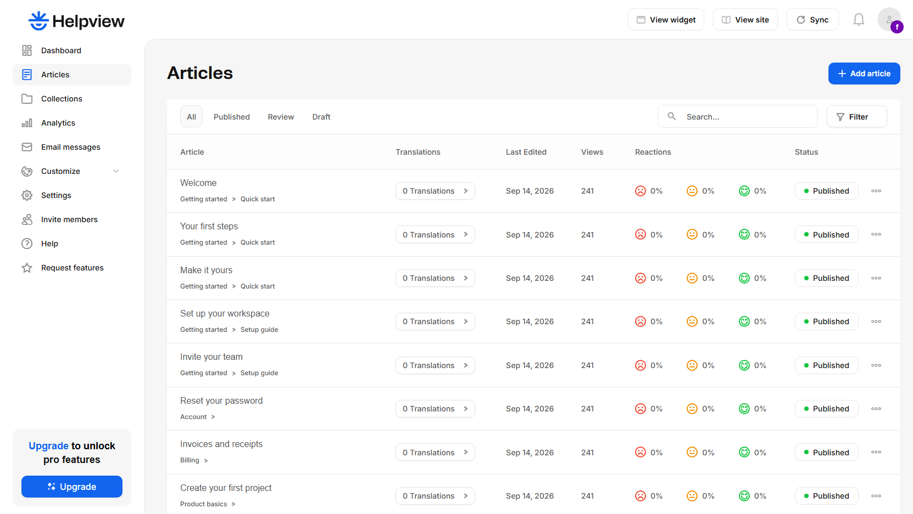
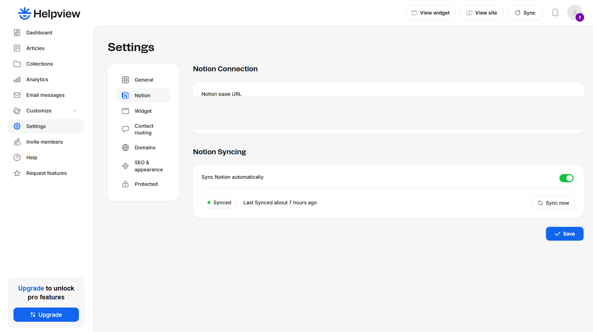

# Helpview

**Category:** SaaS / Knowledge Base / Notion Integration  
**Live:** https://helpview.so/  
**Source code:** Private  
**Role:** Product engineering on a Notion-powered help center SaaS: content sync, publishing, search, theming, custom domains, analytics, and the embedded widget.  
**Problem:** Teams want to keep writing in Notion, but customers need a searchable, branded help center.  
**Result:** A live product that publishes one Notion content source as a help center, documentation, and an embedded widget, with synced publishing and search analytics that expose content gaps.  
**Metric:** 3 | customer-facing surfaces from one Notion content source | product | Help center, documentation, and an embedded help widget  
**Metric:** 3-step | publishing flow | product | Connect Notion, organize content, publish  
**Metric:** Search | with zero-result analytics | product | Shows what customers cannot find  
**Metric:** Synced | publishing from Notion | product | Notion stays the editing source  

## Overview

Helpview turns Notion content into a structured, searchable customer help center. Teams continue writing in Notion while Helpview handles the customer-facing publishing experience.

The product connects one content source to multiple support surfaces such as a help center, documentation, and an embedded help widget.

The users are teams that write their documentation in Notion and need to give customers a real help center, along with the customers who search it. The product has to cover publishing, search, branding, and measuring what customers cannot find.

I worked on the product as an engineer on the full SaaS, not only the page layer. The areas I owned:

- Content synchronization from Notion
- Data structure and publishing state
- Search, theming, and multi-language publishing
- Custom domains and permissions
- Analytics and the embedded support widget

## Product outcomes & evidence

What the product delivers, visible in the live product at helpview.so: three customer-facing surfaces from one Notion content source, a three-step publishing flow, search with zero-result analytics, and publishing that stays synced with Notion.

## Key product & engineering decisions

- Notion stays the editing source: teams keep writing where they already write, and Helpview handles the customer-facing side.
- One content model, many surfaces: the same content feeds the help center, documentation, and the embedded widget.
- Analytics close the loop: search behavior, zero-result searches, and content gaps feed back into improving the documentation.

Coordinating one content source across several surfaces. The product requires coordination across content synchronization, data structure, publishing state, search, theming, permissions, custom domains, analytics, and an embedded support experience.

## System & architecture

`Next.js` `TypeScript` `Supabase` `PostgreSQL` `Notion API` `Cloudflare Workers` `Cloudflare R2` `Vercel`

The product coordinates content synchronization, data structure, publishing state, search, theming, permissions, custom domains, analytics, and an embedded support experience. The application runs on Next.js, TypeScript, Supabase, and PostgreSQL, with the Notion API for content sync, Cloudflare Workers and Cloudflare R2, and Vercel.

Publishing takes three steps:

1. Connect the Notion workspace.
2. Select and organize help content, and configure the help center style and behavior.
3. Publish to a Helpview subdomain or custom domain.

Notion stays the editing source, and search behavior and analytics feed back into improving the documentation over time.

## Outcome

Helpview is live at helpview.so. One Notion content source becomes three customer-facing surfaces through a three-step publishing flow that stays synced with Notion, and search with zero-result analytics shows teams where their documentation has gaps.

- Content architecture: one Notion content source published to a help center, documentation, and an embedded widget
- Search and discovery: a searchable help center with zero-result analytics
- Feedback loops: search behavior and content gaps feed back into the documentation
- Notion integration: synced publishing with Notion as the editing source
- Customer-facing product UX: theming, branding, multiple languages, custom domains, and an embedded widget

## Public portfolio note

The production code and internal implementation remain private. Public information in this case study is limited to product behavior and architecture-level work.
