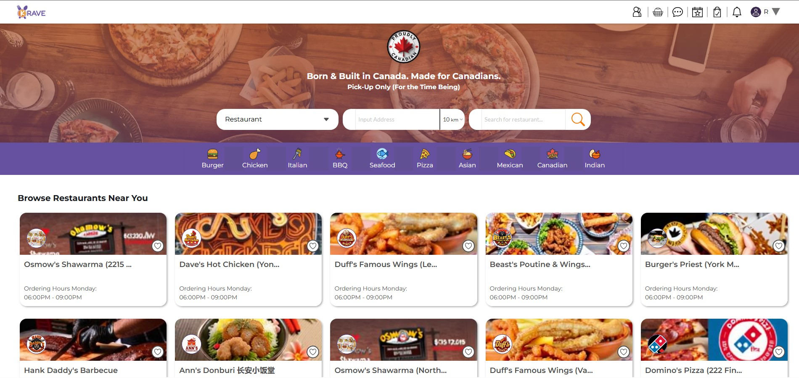
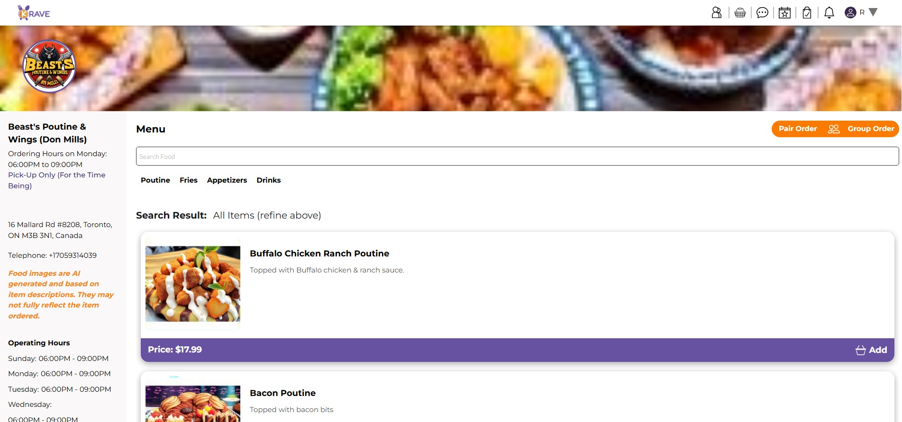

# KraveConnect

**Category:** Food Ordering Marketplace
**Source code:** Private

## Overview

KraveConnect (branded "KRAVE") is a Canadian food-ordering marketplace connecting local restaurants with customers for pickup orders.

## Key areas

- restaurant discovery by cuisine, category, and distance
- individual restaurant menus with item pricing
- pair and group ordering
- account, favorites, and order history navigation
- pickup-only ordering flow

## Screenshots

## Public portfolio note

This case is included based on product screenshots only; a fuller written case study will follow once scope and role are confirmed.
