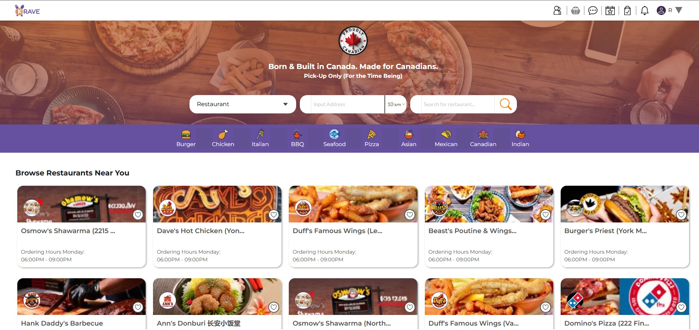
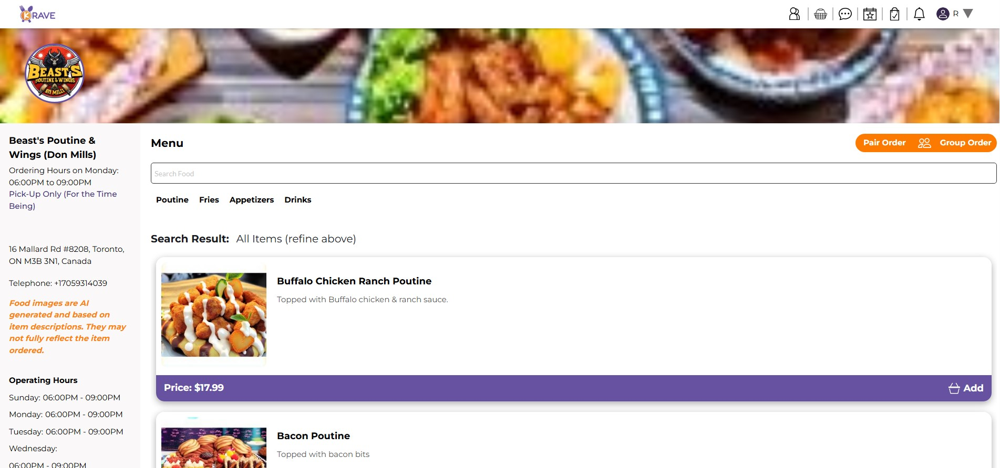

# KraveConnect

**Category:** Food Ordering Marketplace  
**Source code:** Private  
**Problem:** Local restaurants and customers need a simple way to connect for pickup orders.  
**Result:** A pickup-only ordering flow with restaurant discovery, menus, and pair and group ordering.  

## Overview

KraveConnect (branded "KRAVE") is a Canadian food-ordering marketplace connecting local restaurants with customers for pickup orders.

## Problem & users

The users are local restaurants and the customers who order from them for pickup.

## System & architecture

- Restaurant discovery by cuisine, category, and distance
- Individual restaurant menus with item pricing
- Pair and group ordering
- Account, favorites, and order history navigation
- A pickup-only ordering flow

## Public portfolio note

This case is included based on product screenshots only; a fuller written case study will follow once scope and role are confirmed.
