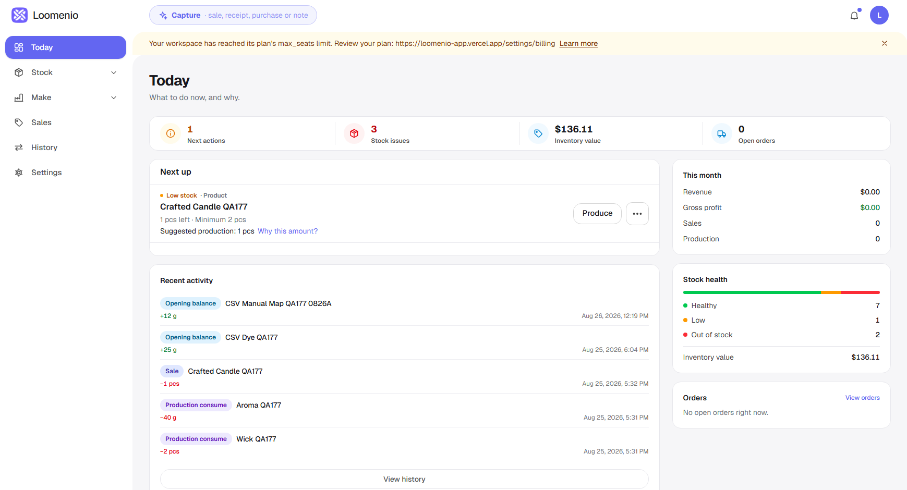
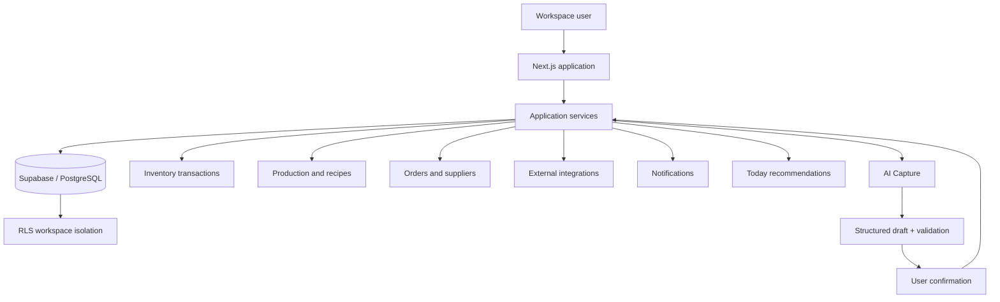
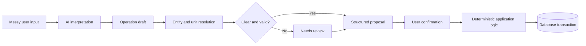

# Loomenio

**Category:** AI-first SaaS / Inventory / Production Operations  
**Live:** https://app.loomenio.com  
**Source code:** Private

## Overview

Loomenio is an operations platform for small-batch manufacturers. It brings inventory, recipes, production, sales, suppliers, imports, integrations, and operational decision support into one product.

The product is built around a simple idea: the application should help a maker understand what needs attention next without handing critical business logic to an LLM.

## My role

I designed and built the product architecture, data model, permissions, inventory and production logic, AI-assisted workflows, integrations, analytics foundations, and responsive application experience.

## Product architecture

## Core product areas

- Materials and SKU management
- Products and recipes
- Production workflows
- Sales and reversals
- Inventory transaction history
- Suppliers and purchase orders
- CSV import
- Multi-workspace accounts
- Role-based access
- Notifications
- External integrations
- Operational recommendations
- AI-assisted data capture

## Architecture

Loomenio uses a multi-workspace SaaS model with workspace membership and role-based permissions.

The application stack includes:

`Next.js` `TypeScript` `Supabase` `PostgreSQL` `RLS` `Vercel`

Database security and workspace isolation are enforced with row-level security. Critical operations are validated through the application and database instead of being delegated directly to AI.

## AI Capture

AI Capture converts messy user input into structured operational drafts that can be reviewed before being applied.

The workflow includes:

1. Parse user input.
2. Detect operation type.
3. Resolve entities and units.
4. Preserve totals and cost semantics.
5. Route ambiguity to review.
6. Build a structured proposal.
7. Require confirmation before applying changes.

The production logic stays deterministic. AI interprets the input, but database updates and business rules remain controlled by application logic.

Live evaluation reached 98.6% operation-type accuracy across an 85-case evaluation set, with 100% entity accuracy for auto-filled entities in that evaluation.

## Today

Today is the operational recommendation layer. It uses deterministic calculations for demand rate, stock cover, reorder points, reorder quantities, and margin-related decisions.

The LLM is not the source of truth. It translates or explains recommendations, while the underlying math is calculated by deterministic product logic.

## Imports and units

The import system handles structured data while enforcing uniqueness and validation. AI-assisted input also resolves compatible units and routes unclear or mismatched units to review instead of silently applying bad quantities.

## Product principle

The central design principle is controlled AI:

> AI can interpret user input and explain system output. Inventory, costing, permissions, and production decisions stay deterministic and auditable.

## What this case demonstrates

- SaaS product architecture
- Multi-tenant data modeling
- Row-level security
- Inventory transaction design
- Production and recipe logic
- AI-assisted structured capture
- Deterministic recommendation systems
- Validation and confirmation boundaries
- Integrations and entitlement logic
- Responsive product delivery
- Large automated test coverage

## Public portfolio note

The production repository is private. This case study intentionally shows product architecture, workflows, screenshots, and engineering decisions without exposing proprietary source code or customer data.
