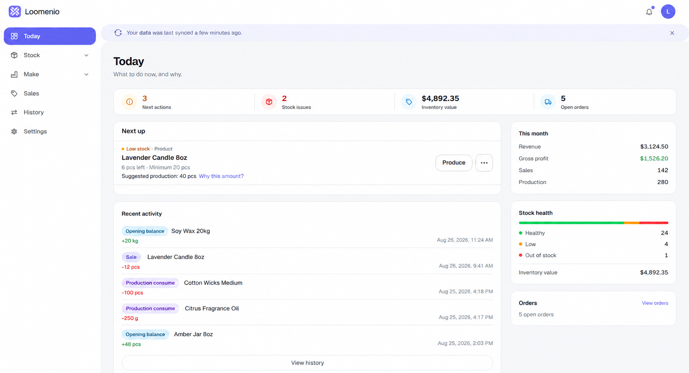
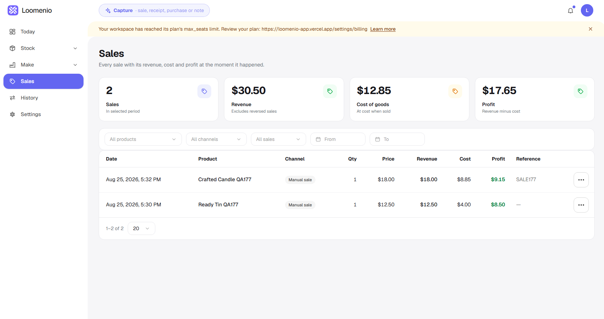
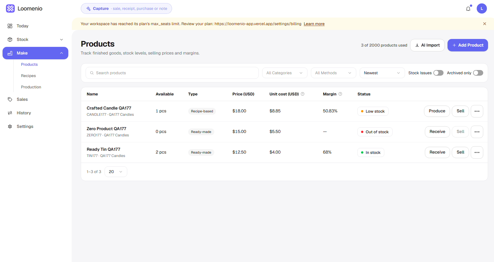
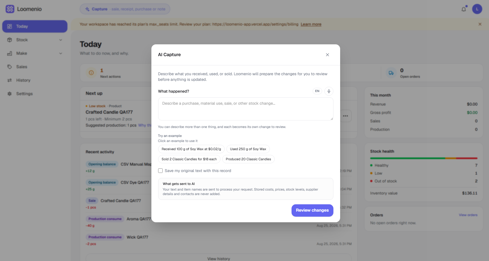
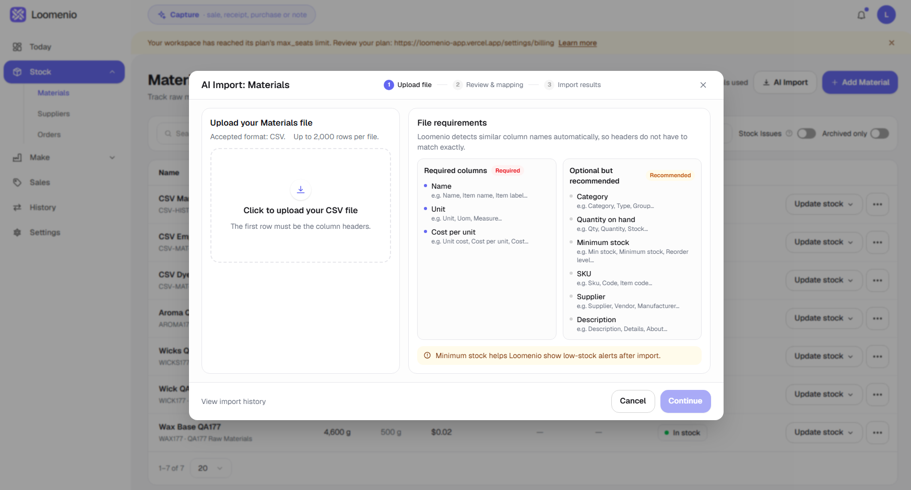

# Loomenio

**Category:** AI-first SaaS / Inventory / Production Operations  
**Live:** https://app.loomenio.com  
**Source code:** Private  
**Role:** Product engineer: designed and built the architecture, data model, permissions, inventory and production logic, AI workflows, integrations, and the responsive experience.  
**Problem:** Small-batch makers keep inventory, recipes, suppliers, and production in disconnected tools, so what needs attention next is never obvious.  
**Result:** 50% faster operational data capture, 30% fewer manual corrections, and under a minute to identify the next operational priority.  
**Metric:** 50% | faster operational data capture | product  
**Metric:** 30% | fewer manual corrections | product  
**Metric:** Under 1 min | to identify the next operational priority | product  
**Metric:** 98.6% | operation-type accuracy in the live evaluation | evidence  
**Metric:** 100% | entity accuracy for auto-filled entities | evidence  
**Metric:** 1,491 | automated tests | evidence  
**Metric:** 85 | cases in the live evaluation | evidence  

## Overview

Loomenio is an operations platform for small-batch manufacturers. It brings inventory, recipes, production, sales, suppliers, imports, integrations, and operational decision support into one product.

The product is built around one idea: the application should help a maker understand what needs attention next, without handing critical business logic to an LLM.

## Problem & users

The users are small-batch makers and manufacturers, working in shared workspaces with different roles. Their inventory, recipes, supplier prices, and production usually live in separate spreadsheets, email threads, and memory. Each number is real, but none of them talk to each other, so the next action is never obvious.

The product therefore had to do three things:

- Capture operational data without slow, error-prone manual entry.
- Show the next operational priority without a manual review of spreadsheets.
- Keep inventory, costing, and permissions correct and auditable.

## My role & ownership

I designed and built the product end to end. The areas I owned:

- Product architecture and the multi-workspace data model
- Role-based access and row-level security
- Inventory transactions, production, and recipe logic
- AI-assisted workflows, including AI Capture and the explanations in Today
- Integrations and analytics foundations
- The responsive application experience

## Product outcomes & evidence

Outcomes for the product, and the AI and engineering evidence behind them.

## Product decisions

- Controlled AI: AI interprets user input and explains system output. Inventory, costing, permissions, and production decisions stay deterministic and auditable.
- Explicit confirmation: the user confirms a structured proposal before any change is applied, and ambiguity goes to review instead of being guessed.
- Recommendations from math, not from a model: Today uses deterministic calculations for demand rate, stock cover, reorder points, reorder quantities, and margin-related decisions. The LLM only translates or explains them.
- Workspaces first: accounts can belong to several workspaces, with workspace membership and role-based permissions deciding what each person can do.
- Records over overwrites: sales support reversals, and inventory changes are kept as a transaction history.
- Review over silent fixes: unclear or mismatched units are routed to review instead of silently applying bad quantities.

## System & architecture

Loomenio is a multi-workspace SaaS application.

`Next.js` `TypeScript` `Supabase` `PostgreSQL` `RLS` `Vercel`

- Application: a Next.js application with services for inventory transactions, production and recipes, orders and suppliers, external integrations, notifications, Today recommendations, and AI Capture.
- Data: Supabase and PostgreSQL, with row-level security enforcing workspace isolation.
- Validation boundary: critical operations are validated in the application and the database, not delegated to AI.
- Product areas: materials and SKUs, products and recipes, production workflows, sales and reversals, inventory transaction history, suppliers and purchase orders, CSV import, notifications, external integrations, and operational recommendations.

## Key challenge

Real input is messy, while inventory and costing must stay exact. AI Capture turns messy user input into structured operational drafts that can be reviewed before they are applied.

1. Parse user input.
2. Detect the operation type.
3. Resolve entities and units.
4. Preserve totals and cost semantics.
5. Route ambiguity to review.
6. Build a structured proposal.
7. Require confirmation before applying changes.

AI interprets the input. Database updates and business rules stay under deterministic application logic.

## Validation & production quality

- Live evaluation: an 85-case evaluation set reached 98.6% operation-type accuracy, with 100% entity accuracy for auto-filled entities.
- Automated tests: 1,491 automated tests cover the product.
- Imports: the import system handles structured data while enforcing uniqueness and validation.
- Units: AI-assisted input resolves compatible units and routes unclear or mismatched units to review.
- Data isolation: row-level security keeps each workspace's data separate, and critical operations are validated in both the application and the database.

## Outcome

Loomenio is live as a production product. It delivers 50% faster operational data capture, 30% fewer manual corrections, and under a minute to identify the next operational priority. The AI workflow reached 98.6% operation-type accuracy in live evaluation while business-critical logic stays deterministic, and the product is covered by 1,491 automated tests.

## What this demonstrates

- End-to-end product ownership: from problem framing and data model to AI workflows and the responsive interface.
- Production SaaS architecture: a multi-workspace model, application services, and a validated data layer.
- AI with deterministic safeguards: AI interprets, deterministic logic decides, and the user confirms.
- Relational data and permissions: transaction history, role-based access, and row-level security.
- Evaluation and testing: a live evaluation set and a large automated test suite.
- Product decisions under real operational constraints: messy input, exact inventory and costing, and small-team workflows.

## Public portfolio note

The production repository is private. This case study intentionally shows product architecture, workflows, screenshots, and engineering decisions without exposing proprietary source code or customer data.
