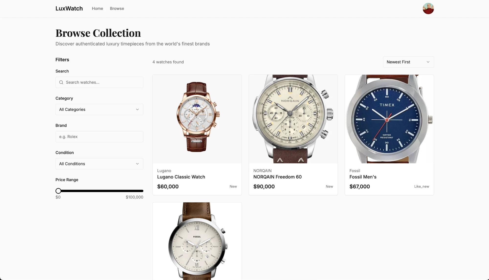
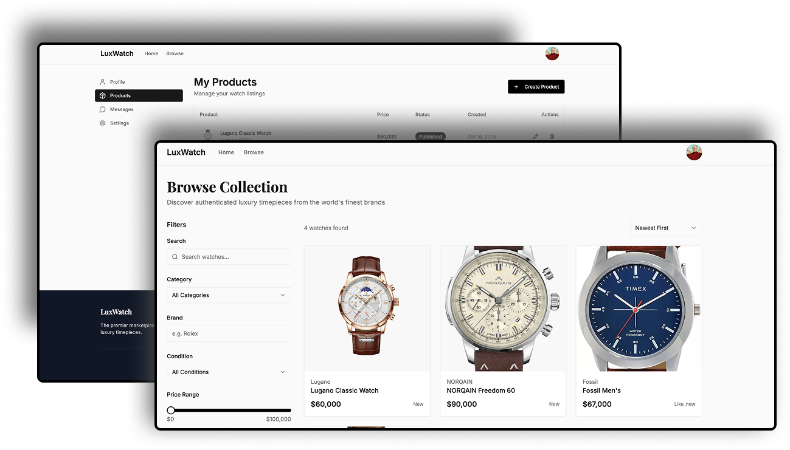
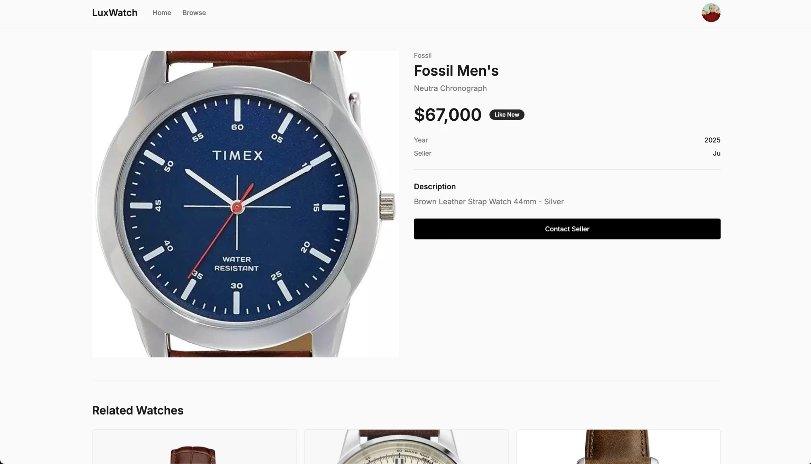
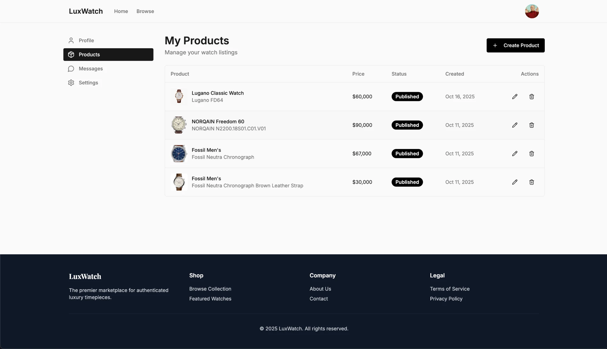
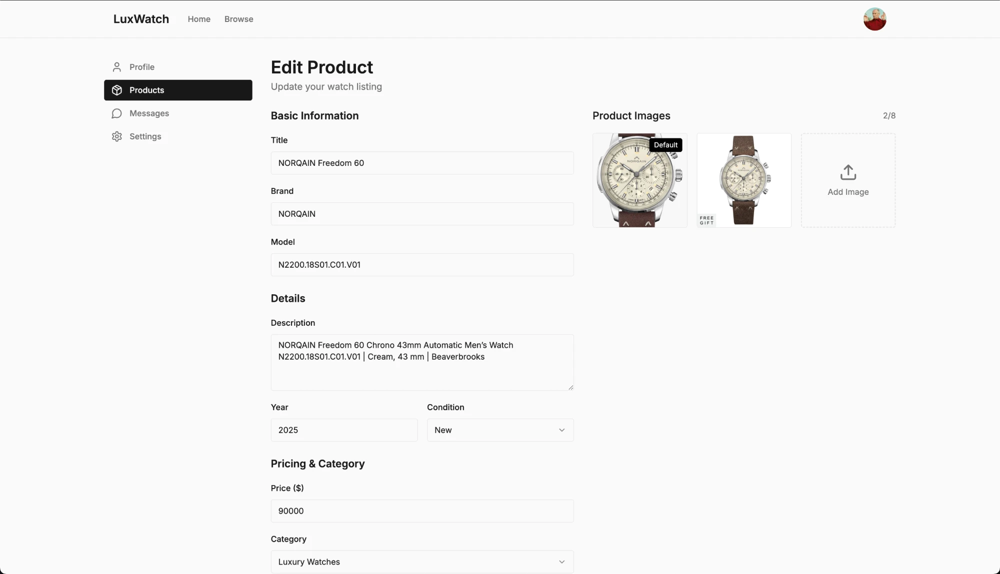
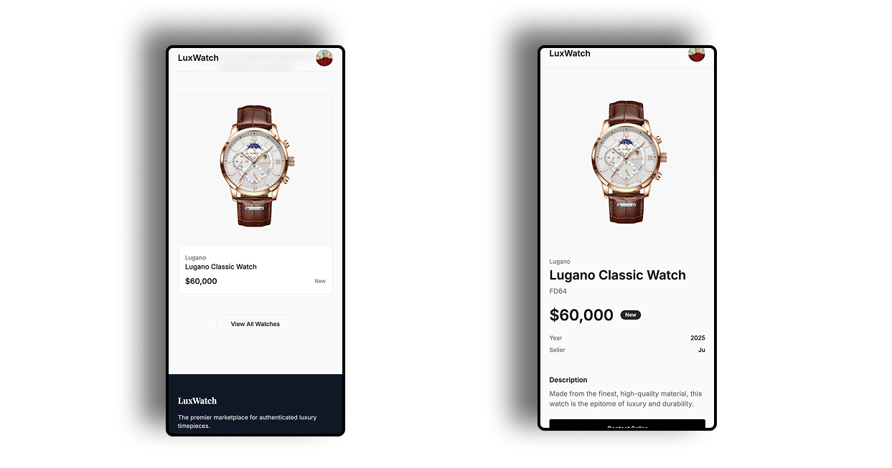

# LuxWatch

**Category:** Marketplace / SaaS Product  
**Source code:** Private  
**Role:** Product and engineering on a two-sided luxury watch marketplace: listings, browse and search filters, seller product management, profiles, and the responsive interface.  
**Problem:** A luxury watch marketplace needs two journeys in one product: buyers discovering and contacting sellers, and sellers creating and managing their own listings.  
**Result:** A two-sided marketplace with buyer-facing browse, search, and product pages and a seller dashboard for creating and editing listings, responsive on desktop and mobile.  

## Overview

LuxWatch is a two-sided luxury watch marketplace: buyers discover and compare listings, and sellers create and manage their own.

It is a marketplace, not a product gallery. Buyers browse, search, and filter a catalog and contact sellers from a product page, while sellers work in their own area to create, edit, and publish listings with images. I worked on the product and data design behind both journeys, from listings and filters to seller product management.

- Buyer journey: landing page, featured watches, browse with search and filters, and product pages
- Seller journey: a products dashboard with create, edit, publish status, and delete
- Listing model: brand, model, year, condition, price, category, description, and up to eight images
- Responsive layout: the same marketplace pages on desktop and mobile

## Product outcomes & evidence

No numeric results are claimed. The evidence is the shipped product itself, as shown in its own screens.

- Landing and discovery: a landing page with Explore Collection and Start Selling entry points, and a featured watches carousel.
- Browse, search, and filters: search, category, brand, condition, and price range filters, with sorting such as Newest First.
- Product detail: brand, title, model, price, condition, year, seller, description, a Contact Seller action, and related watches.
- Seller product management: a My Products list with price, status, created date, and edit and delete actions, plus Create Product.
- Create and edit listing: title, brand, model, description, year, condition, price, and category, with image management.
- Responsive experience: the featured carousel and product pages on mobile.

## Key product & engineering decisions

- Buyer and seller journeys kept separate: buyers use the public landing, browse, and product pages, while sellers use their own account area with Profile, Products, Messages, and Settings.
- Catalog, search, and filters: browse combines text search with category, brand, condition, and price-range filters and a sort order, so buyers can narrow the catalog by what matters to them.
- Listing lifecycle and status: each listing has a status and a created date, and can be edited or deleted from one list.
- Product image management: a listing holds up to eight images, with a default image, and images are added from the edit form.
- Responsive marketplace UX: the same marketplace pages adapt to mobile, from the featured carousel to the product page.

## System & architecture

The product is organized like this, based on its own navigation and screens:

- Users and roles: buyers browsing the public pages, and sellers with a profile and their own product area, with the seller shown on each listing.
- Listings and catalog: listing records with brand, model, year, condition, price, category, description, and status.
- Product media: up to eight images per listing, with a default image.
- Discovery, search, and filtering: search, category, brand, condition, and price range, plus sorting.
- Seller management: a products list with create, edit, and delete actions and a status for each listing.
- Messaging and contact: a Contact Seller action on each product page and a Messages area for sellers.
- Responsive frontend: layouts for desktop and mobile.

Beyond the screens shown, the product also covers admin controls, payment-related workflows, and a transaction-oriented data model.

## Validation & production quality

- Create and edit flows: listings are created and edited through one form with basic information, details, pricing, and images.
- Search and filtering: the catalog narrows by search, category, brand, condition, and price range, and shows how many watches match.
- Listing data: the same listing data, such as title, brand, price, and condition, appears consistently on the browse cards, the product page, and the seller list.
- Product images: the edit form shows how many of the eight image slots are used and which image is the default.
- Buyer and seller routes: public pages for buyers and a separate account area for sellers.
- Responsive checks: the same pages are shown on desktop and mobile.

## Outcome

LuxWatch shows marketplace product engineering: a buyer-facing catalog with search and filters and a seller-facing listing workflow, designed as one two-sided product.

Capabilities demonstrated:

- Marketplace product engineering, from discovery to listing management
- Two-sided UX with separate buyer and seller journeys
- Catalog and data modeling for listings, status, and images
- Workflow design for creating and editing listings
- Responsive delivery across desktop and mobile

## Public portfolio note

The listings, prices, and seller profile shown in the screenshots are demo data. Source code and internal implementation details are not public.
