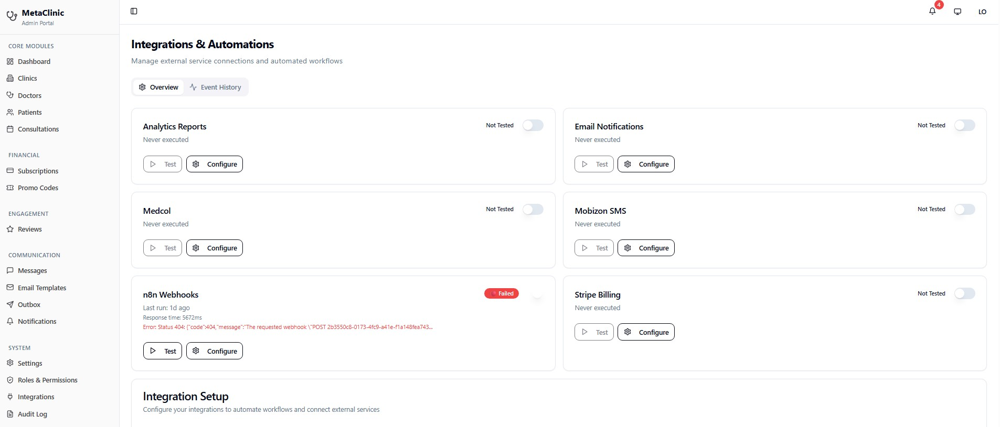
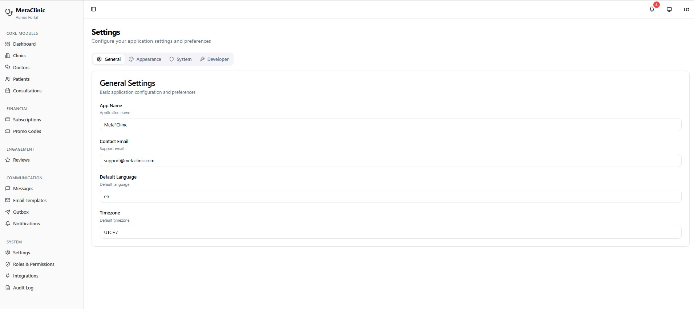

# MetaClinic

**Category:** Healthcare Admin / Internal System
**Source code:** Private

## Overview

MetaClinic is a production-ready admin portal for a multi-clinic healthcare network.

## Key areas

- dashboards with operational KPIs
- client and patient records
- consultation statuses
- doctors and providers
- filters and notifications
- finance-related workflows
- user roles and permissions
- admin workflows
- responsive operational UI

## Screenshots

## Public portfolio note

Patient- and client-identifying screens are intentionally excluded from this public case study; only aggregate, operational, and configuration views are shown.
