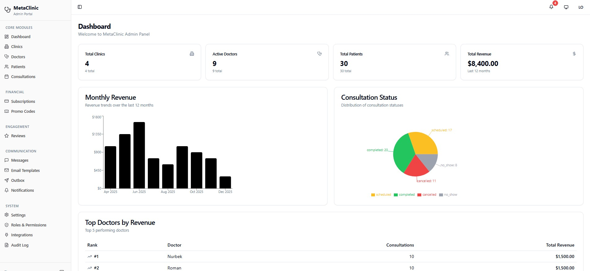
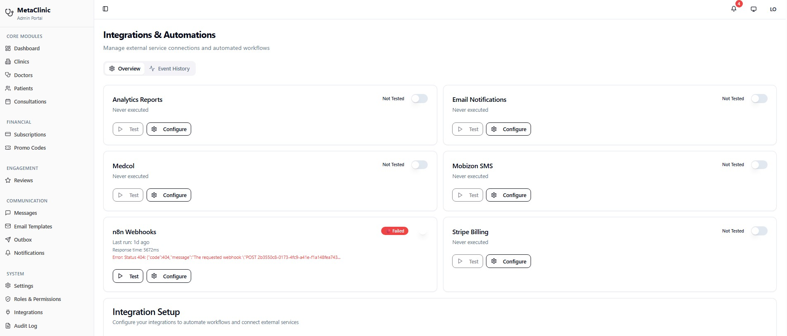
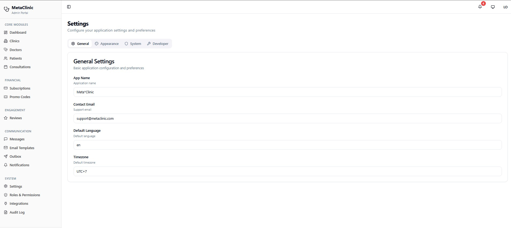

# MetaClinic

**Category:** Healthcare Admin / Internal System
**Source code:** Private
**Role:** Product and engineering on the admin portal: relational data model, role-based access, finance and billing workflows, notifications, storage, and scheduled jobs.
**Problem:** A multi-clinic healthcare network needs one admin portal for operational KPIs, records, consultations, and finance-related workflows.
**Result:** A production-ready admin portal with dashboards, role-based access, and responsive operational screens.

## Overview

MetaClinic is a production-ready, multi-clinic admin and product system for a healthcare network: clinics, doctors, patients, consultations, finance, and communication in one role-based portal.

Its users are the administrative staff of the network, working with different roles and permissions. It is an operations system rather than a dashboard: the portal carries the network's records, consultation workflow, billing, and notifications. I worked on the product and system design behind it, from the data model and role-based access to billing, notifications, and background jobs.

- Multi-clinic, multi-role access with an audit log
- Clinic, doctor, patient, and consultation records
- Finance, subscriptions, promo codes, and revenue visibility
- Messages, email templates, notifications, and integrations

## Product outcomes & evidence

No numeric results are claimed. The evidence is the shipped product itself, as shown in its own screens.

- Clinic operations: a dashboard with totals for clinics, active doctors, patients, and revenue.
- Records: modules for clinics, doctors, patients, and consultations.
- Consultation statuses: scheduled, completed, cancelled, and no-show, with a distribution chart.
- Finance and revenue: monthly revenue over twelve months, top doctors by revenue, subscriptions, and promo codes.
- Communication: messages, email templates, an outbox, and notifications.
- Access and traceability: roles and permissions, and an audit log.
- Integrations and settings: an integrations screen with test and configure actions and an event history, plus general, appearance, system, and developer settings.

## Key product & engineering decisions

- Multi-clinic, multi-role access: administrative staff work across a network of clinics with different roles and permissions, managed in a roles and permissions area and traced in an audit log.
- Patient and doctor data structure: clinics, doctors, patients, and consultations are modeled as related records in PostgreSQL.
- Consultation workflow states: consultations move through explicit statuses (scheduled, completed, cancelled, no-show), which the dashboard summarizes.
- Finance and billing workflows: subscriptions, promo codes, and revenue reporting sit in one financial area, with Stripe handling payments.
- Notifications and operational visibility: messages, email templates, an outbox, and notifications cover communication, while the integrations event history and the audit log show what ran.

## System & architecture

`Next.js` `TypeScript` `Supabase` `PostgreSQL` `Stripe` `Vercel`

The system is organized like this:

- Application layer: Next.js and TypeScript, a responsive admin portal with dashboards, filters, and notifications.
- Relational data model: Supabase and PostgreSQL.
- Authentication and access: Supabase Auth with role-based access control, plus a roles and permissions area and an audit log in the portal.
- Clinics, doctors, patients, consultations: separate modules with consultation statuses.
- Billing and payments: Stripe, with subscriptions and promo codes in the financial area.
- Email and notifications: SendGrid for email, with email templates, an outbox, and in-portal notifications.
- Files and storage: Supabase Storage for file workflows.
- Background and scheduled jobs: scheduled (cron) jobs and Supabase Edge Functions.
- Deployment: Vercel.

The integrations screen lists connectors for analytics reports, email notifications, Medcol, Mobizon SMS, n8n webhooks, and Stripe billing.

## Validation & production quality

- Responsive interface: the operational screens are built to be responsive.
- Integration checks in the product: each integration has a test action and an event history, and a failed run is shown with its error message.
- Traceability: an audit log and the integration event history record what happened in the portal.

## Outcome

MetaClinic is a production-ready multi-clinic admin system that brings clinic operations, records, consultations, finance, and communication into one role-based portal.

Capabilities demonstrated:

- Multi-role SaaS product engineering for a multi-site healthcare operation
- Relational data modeling for clinics, doctors, patients, and consultations
- Role-based access and admin workflows
- Billing, email, and scheduled-job integrations
- Operational dashboards and responsive admin UX

## Public portfolio note

Patient- and client-identifying screens are intentionally excluded from this public case study; only aggregate, operational, and configuration views are shown.
