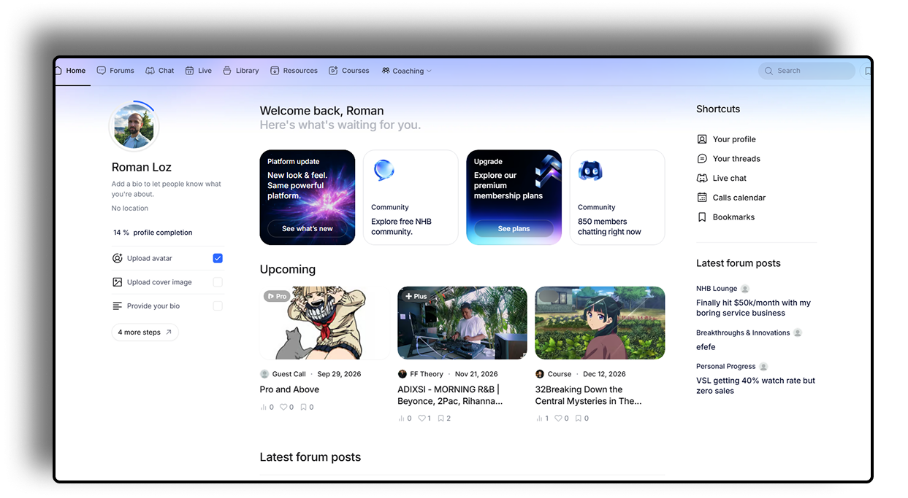
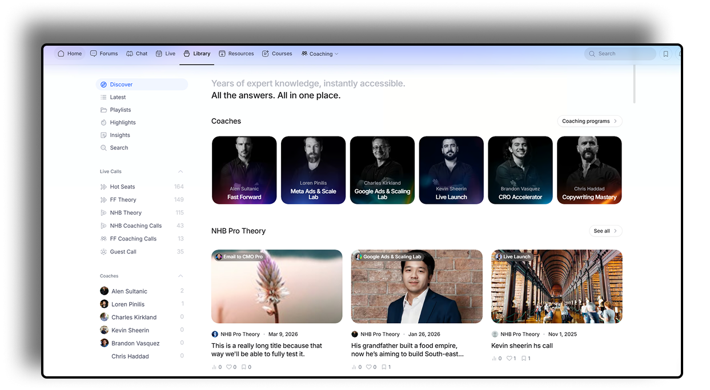
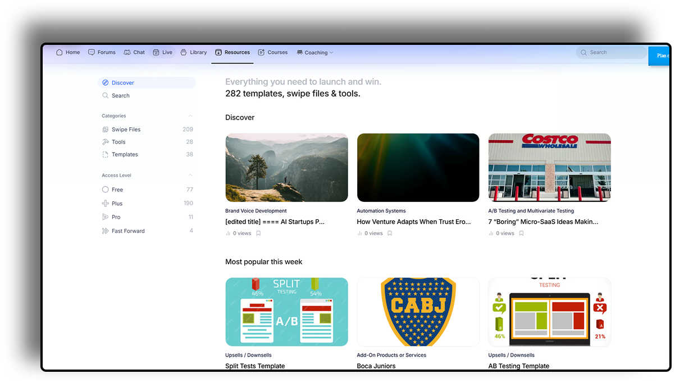
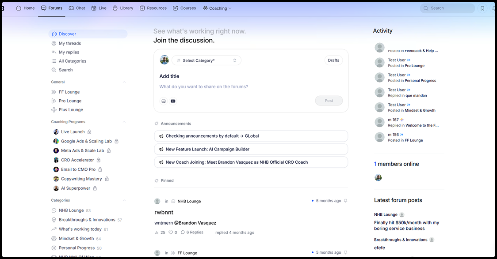
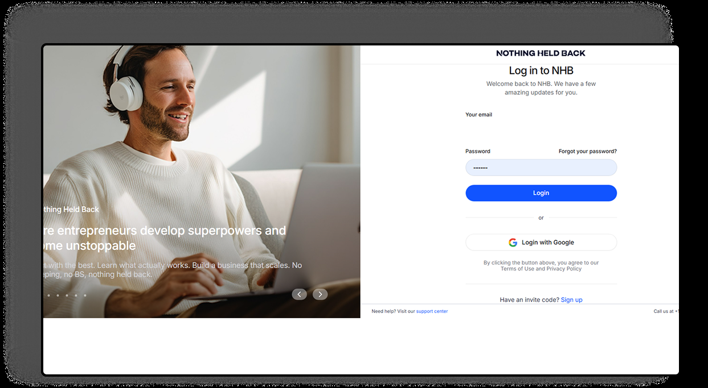
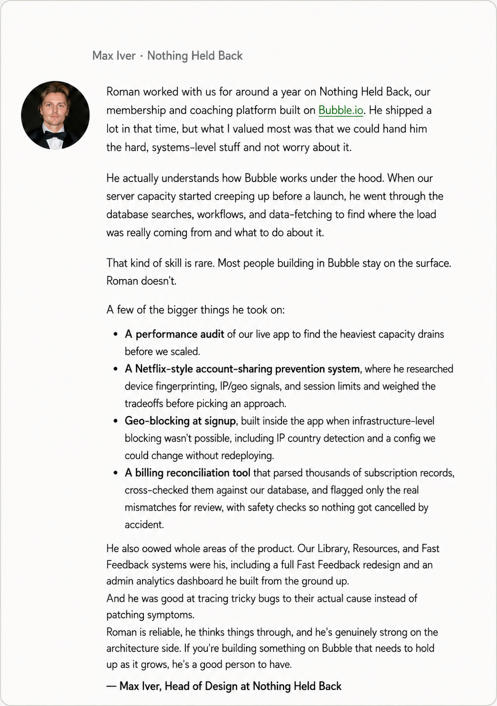

# Nothing Held Back (NHB)

**Category:** SaaS / Membership & Coaching Platform  
**Stack:** Bubble.io  
**Source code:** Private

## Overview

Nothing Held Back (NHB) is a membership and coaching platform for entrepreneurs, built on Bubble.io. The product combines a content library, a resource hub, community forums, live coaching calls, and tiered paid membership into one workspace.

According to the client, Roman worked on NHB for around a year, brought in for the systems-level engineering behind the product rather than surface-level feature work.

## Screenshots

## Product surface

Based on the product's own navigation and screens:

- Home feed with platform updates, community stats, and personalized activity
- Content library organized by coach and program (programs visible in-product include Fast Forward, Meta Ads & Scale Lab, Google Ads & Scaling Lab, Live Launch, CRO Accelerator, and Copywriting Mastery)
- Resource hub of templates, swipe files, and tools, gated by membership tier (Free, Plus, Pro, Fast Forward)
- Community forums organized into topic- and program-specific categories
- Live coaching calls ("Hot Seats") with a calendar and call recordings
- Email/password and Google OAuth login, invite-code signup
- Tiered membership, from free community access up to paid plans

## Engineering work

The client's account of the engagement, in their own words:

- A performance audit of the live app to identify the heaviest capacity drains before a scaling push
- A Netflix-style account-sharing prevention system — evaluating device fingerprinting, IP/geo signals, and session limits before choosing an approach
- Geo-blocking built into the application itself (infrastructure-level blocking wasn't an option), including IP country detection and a config changeable without a redeploy
- A billing reconciliation tool that parsed subscription records, cross-checked them against the database, and flagged only genuine mismatches for review, with safety checks against accidental cancellations
- Ownership of the Library, Resources, and Fast Feedback areas of the product, including a full Fast Feedback redesign
- An admin analytics dashboard built from scratch
- Root-cause debugging rather than symptom-patching, per the client

## Client feedback

> "Roman worked with us for around a year on Nothing Held Back, our membership and coaching platform built on Bubble.io. He shipped a lot in that time, but what I valued most was that we could hand him the hard, systems-level stuff and not worry about it."

> "Roman is reliable, he thinks things through, and he's genuinely strong on the architecture side. If you're building something on Bubble that needs to hold up as it grows, he's a good person to have."

— Max Iver, Head of Design at Nothing Held Back

The full review is preserved verbatim in [`assets/testimonials/testimonials.json`](../assets/testimonials/testimonials.json) (id `nhb-review-01`), including one line with an apparent typo in the source card. The excerpts above are drawn only from the unaffected sentences.

## What this case demonstrates

- Performance auditing and capacity planning under real scaling pressure
- Abuse-prevention system design (account-sharing prevention, geo-blocking)
- Data reconciliation tooling with safety checks against destructive automation
- Ownership of entire product surfaces rather than isolated tickets
- Admin tooling built from scratch
- Root-cause debugging discipline

## Public portfolio note

This case study is built only from product screenshots and a client testimonial provided directly — no other source material (contracts, dates, internal documentation) was available at the time of writing. Figures visible in the screenshots (e.g. member counts, content counts) reflect a single point in time and aren't claimed as current.
