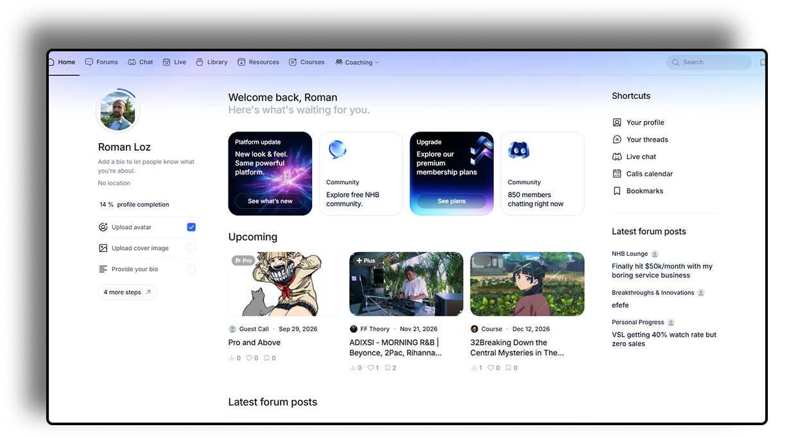
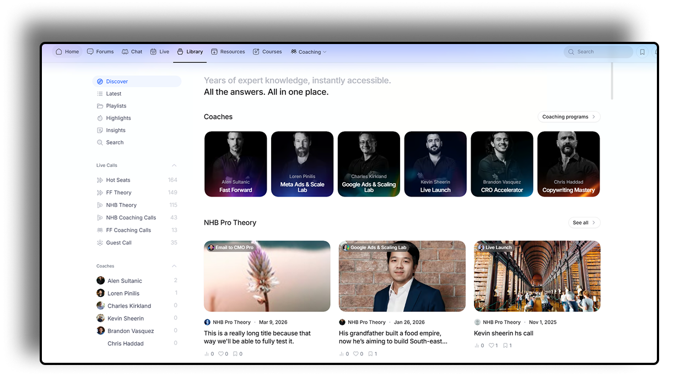
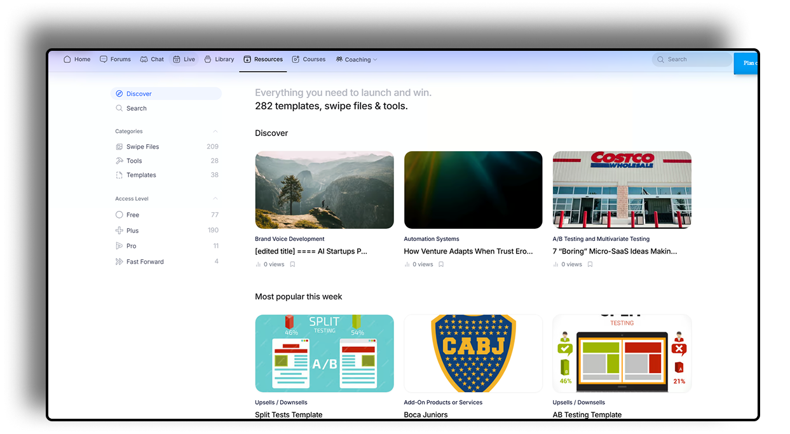
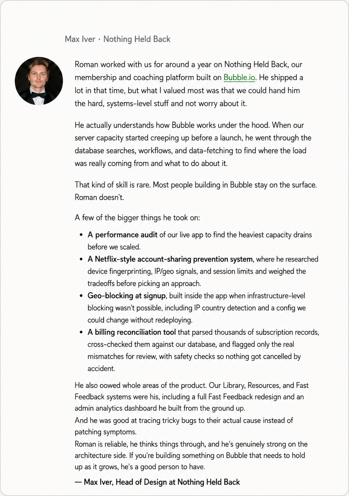
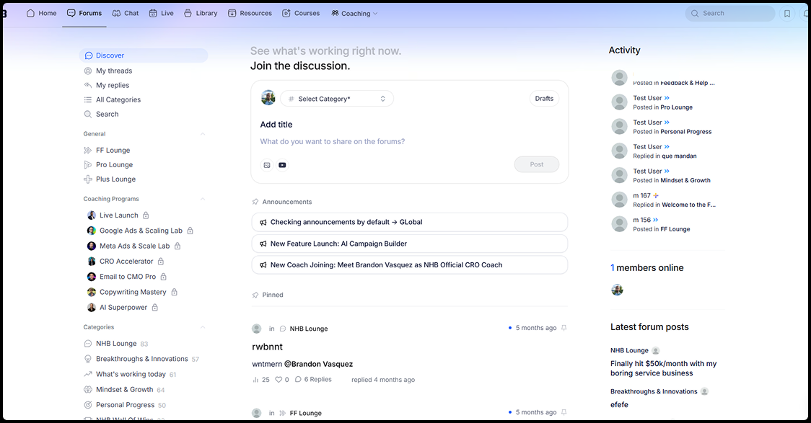
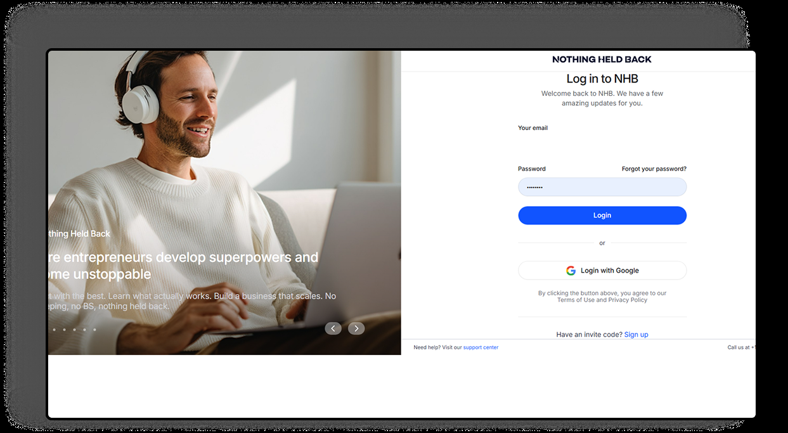

# Nothing Held Back (NHB)

**Category:** SaaS / Membership & Coaching Platform  
**Live:** https://app.nothingheldback.com/login  
**Live label:** Open live app  
**Website:** https://www.nothingheldback.com/  
**Source code:** Private  
**Role:** Systems-level engineer: around a year on the membership and community platform, covering performance, abuse prevention, billing reconciliation, three product areas, and admin analytics.  
**Problem:** A growing membership and coaching platform needed to hold up under scale, with account sharing, geographic restrictions, and billing accuracy under control.  
**Result:** A unified, multi-surface growth and community platform: 23 apps in one platform for 48,495+ community members, with 3-5 weekly live content sessions.  
**Metric:** 48,495+ | community members | product  
**Metric:** 23 | apps in one platform | product  
**Metric:** 3-5 | weekly live content sessions | product  

## Overview

Nothing Held Back (NHB) is a membership and coaching platform for entrepreneurs. The product combines a content library, a resource hub, community forums, live coaching calls, and tiered paid membership into one workspace.

I worked on NHB for around a year, brought in for the systems-level engineering behind the product rather than surface-level feature work.

The users are entrepreneurs who join as members, from free community access up to paid plans, and the coaches who run programs for them. The platform faced a scaling push and the problems that come with it: heavy capacity drains, shared accounts, geographic restrictions, and subscription records that had to match the database.

The engagement covered:

- Ownership of the Library, Resources, and Fast Feedback areas of the product, including a full Fast Feedback redesign
- An admin analytics dashboard built from scratch
- A performance audit, an account-sharing prevention system, geo-blocking, and a billing reconciliation tool
- Root-cause debugging rather than symptom-patching

## Product outcomes & evidence

The platform's reach and breadth lead the evidence: a large community, many apps in one platform, and live content every week. The client's review is supporting social proof.

## Key product & engineering decisions

- Account sharing: a Netflix-style prevention system, with device fingerprinting, IP/geo signals, and session limits evaluated before choosing an approach.
- Geo-blocking in the application: infrastructure-level blocking was not an option, so it was built into the application itself, including IP country detection and a configuration that can change without a redeploy.
- Billing reconciliation: a tool that parsed subscription records, cross-checked them against the database, and flagged only genuine mismatches for review, with safety checks against accidental cancellations.
- Root cause over symptoms: problems were debugged to their cause rather than patched.

Preparing a live platform for a scaling push. The engagement began with a performance audit of the live app to identify the heaviest capacity drains before scaling.

## System & architecture

`Next.js` `TypeScript` `Supabase` `PostgreSQL` `APIs` `Automation` `AI integrations` `Google OAuth`

The platform is built on Next.js and TypeScript with Supabase and PostgreSQL, and APIs, automation, and AI integrations connect its surfaces. Based on the product's own navigation and screens, its surface includes:

- A home feed with platform updates, community stats, and personalized activity
- A content library organized by coach and program
- A resource hub of templates, swipe files, and tools, gated by membership tier (Free, Plus, Pro, Fast Forward)
- Community forums organized into topic- and program-specific categories
- Live coaching calls ("Hot Seats") with a calendar and call recordings
- Email/password and Google OAuth login, invite-code signup, and tiered membership

## Validation & production quality

- The billing reconciliation tool cross-checks subscription records against the database and includes safety checks against accidental cancellations.
- The performance audit was run on the live app to identify the heaviest capacity drains.
- Geo-blocking configuration can be changed without a redeploy.

## Outcome

NHB is a unified, multi-surface growth and community platform: 23 apps in one platform for 48,495+ community members, with 3-5 live content sessions every week. The engagement delivered a performance audit, account-sharing prevention, geo-blocking, billing reconciliation, redesigned and owned product areas, and a new admin analytics dashboard, with hard systems-level work handled reliably. In the client's words:

> "He shipped a lot in that time, but what I valued most was that we could hand him the hard, systems-level stuff and not worry about it."

> "Roman is reliable, he thinks things through, and he's genuinely strong on the architecture side."

Max Iver, Head of Design at Nothing Held Back

- A unified, multi-surface growth and community platform: library, resources, forums, live sessions, and membership tiers in one product
- Platform scale: 48,495+ community members and 23 apps in one platform
- Performance auditing and capacity planning under real scaling pressure
- Abuse-prevention system design: account-sharing prevention and geo-blocking
- Data reconciliation tooling with safety checks against destructive automation
- Ownership of entire product surfaces, admin tooling built from scratch, and root-cause debugging discipline

## Public portfolio note

Figures visible in the screenshots (for example member counts and content counts) reflect a single point in time and are not claimed as current. Source code, customer data, and internal implementation details are not public.
