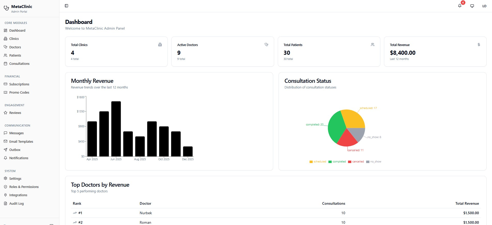
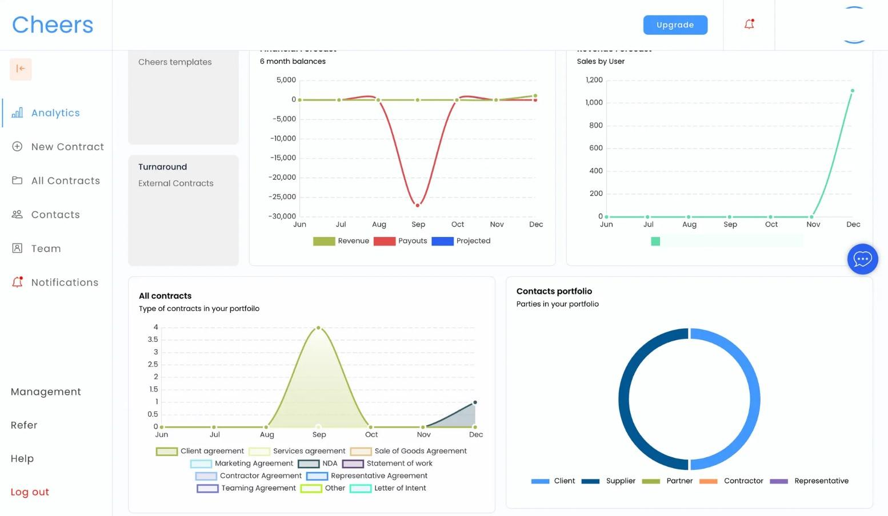
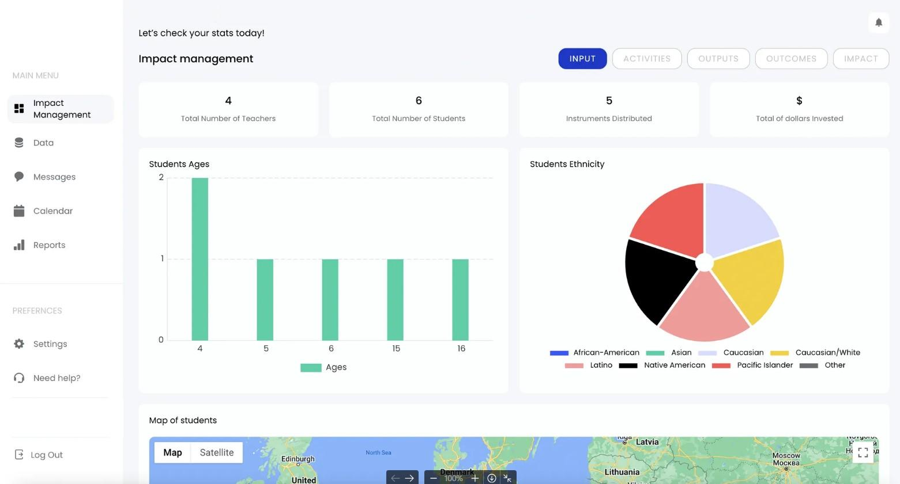

# Selected Client Systems

These projects are supporting examples of workflow-heavy SaaS and internal business systems. They are not positioned as the primary featured work, but they show breadth across operational products.

## Healthcare Admin Portal

A production-ready admin portal for a multi-clinic healthcare network.

Key areas:

- dashboards with operational KPIs
- client and patient records
- consultation statuses
- doctors and providers
- filters and notifications
- finance-related workflows
- user roles and permissions
- admin workflows
- responsive operational UI

## Contract Management SaaS

A workflow-heavy contract management product with analytics, contract pipeline, status tracking, contact CRM, team management, notifications, templates, search, pagination, and responsive UI.

Key areas:

- contract pipeline and status tracking
- CRM and contact management
- analytics dashboard
- team and role-based access
- notifications and templates
- billing, email, and SMS integration hooks
- product and data structure design

## Education and Impact Management Platform

An operations platform for a music-education nonprofit.

Modules included impact dashboards, activity and outcome tracking, student and teacher management, inventory, class scheduling, re-enrollment, surveys, messages, reports, attendance, and instrument management.

## Luxury Watch Marketplace

A marketplace concept for trading and managing luxury watches.

The product included listings, browse and search filters, seller product management, profiles, admin-style controls, transaction-oriented data structure, and responsive UI.

## SaaS Architecture Rescue

Architecture and cleanup work for SaaS apps and internal systems that had become slow, difficult to change, or hard to scale.

Typical review areas:

- database structure and relationships
- backend workflows and automation logic
- privacy rules, roles, and permissions
- heavy searches and page performance
- APIs, webhooks, and error handling
- admin workflows and reporting
- duplicated logic and technical debt
- scaling risks

The goal is to decide what should be cleaned up, optimized, rebuilt, or left in place before more features are added.

## Why these projects matter

Together these projects show experience with business software where the difficult part is not the visual layer alone. The core work is data modeling, workflow design, permissions, operational clarity, integrations, and maintainability.
