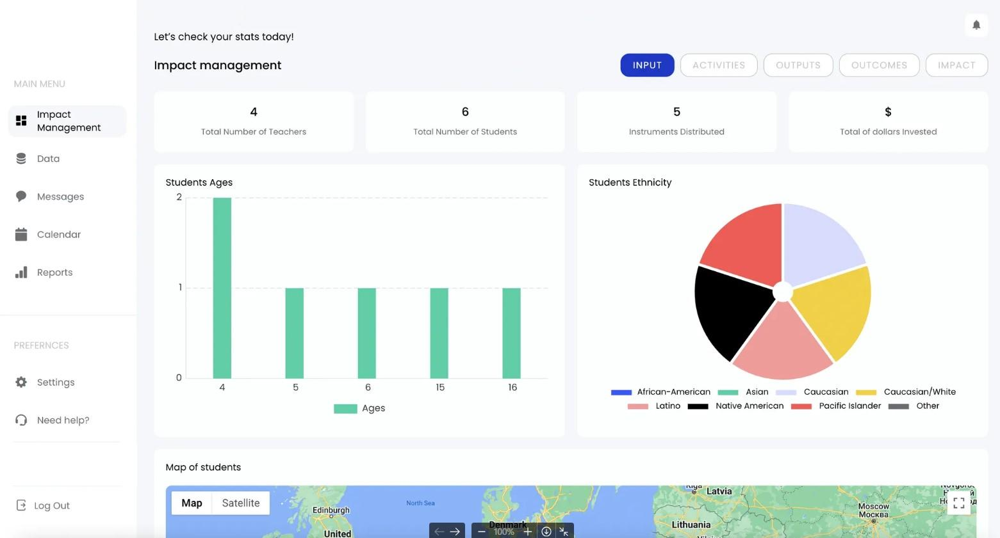

# Selected Client Systems

**Problem:** Workflow-heavy business software where the hard part is data, workflows, and permissions, not the visual layer.  
**Result:** Three supporting examples across operations, marketplace, and architecture rescue work.  

## Overview

Supporting examples of workflow-heavy SaaS and internal business systems, showing breadth across operational products.

Each project serves a different user and problem:

- Education and Impact Management Platform: an operations platform for a music-education nonprofit.
- Luxury Watch Marketplace: a marketplace concept for trading and managing luxury watches.
- SaaS Architecture Rescue: architecture and cleanup work for SaaS apps and internal systems that had become slow, difficult to change, or hard to scale.

## Key product & engineering decisions

Deciding what to change in a system that already runs. The goal of an architecture rescue is to decide what should be cleaned up, optimized, rebuilt, or left in place before more features are added.

## System & architecture

- Education and Impact Management Platform: impact dashboards, activity and outcome tracking, student and teacher management, inventory, class scheduling, re-enrollment, surveys, messages, reports, attendance, and instrument management.
- Luxury Watch Marketplace: listings, browse and search filters, seller product management, profiles, admin-style controls, a transaction-oriented data structure, and a responsive UI.
- SaaS Architecture Rescue, typical review areas: database structure and relationships, backend workflows and automation logic, privacy rules, roles, and permissions, heavy searches and page performance, APIs, webhooks, and error handling, admin workflows and reporting, duplicated logic and technical debt, and scaling risks.

## Outcome

Together these projects show experience with business software where the difficult part is not the visual layer alone. The core work is data modeling, workflow design, permissions, operational clarity, integrations, and maintainability.
