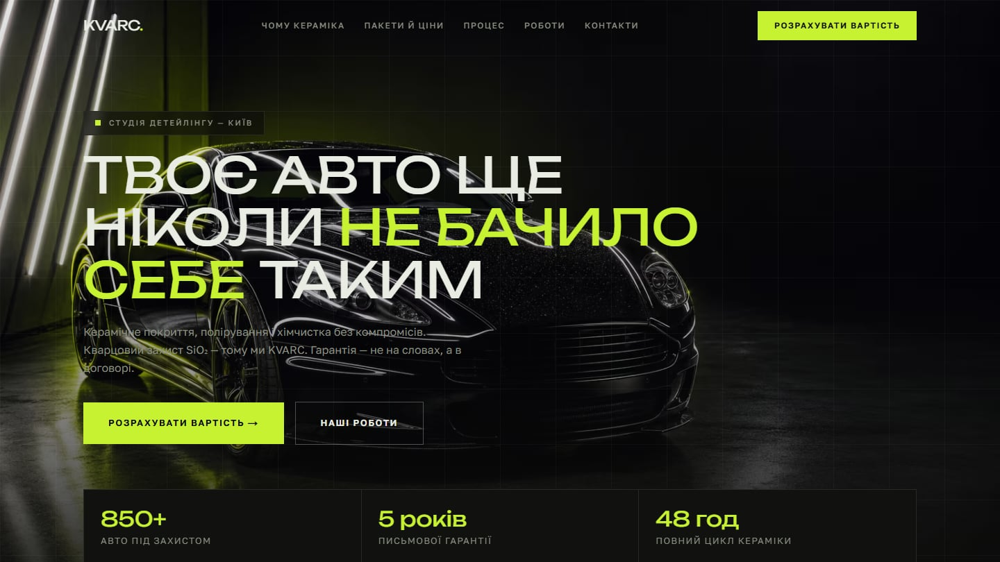
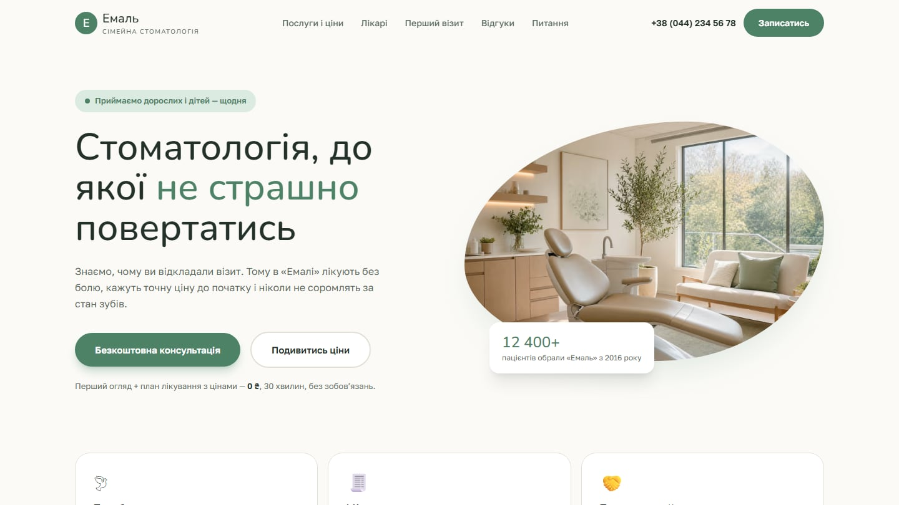
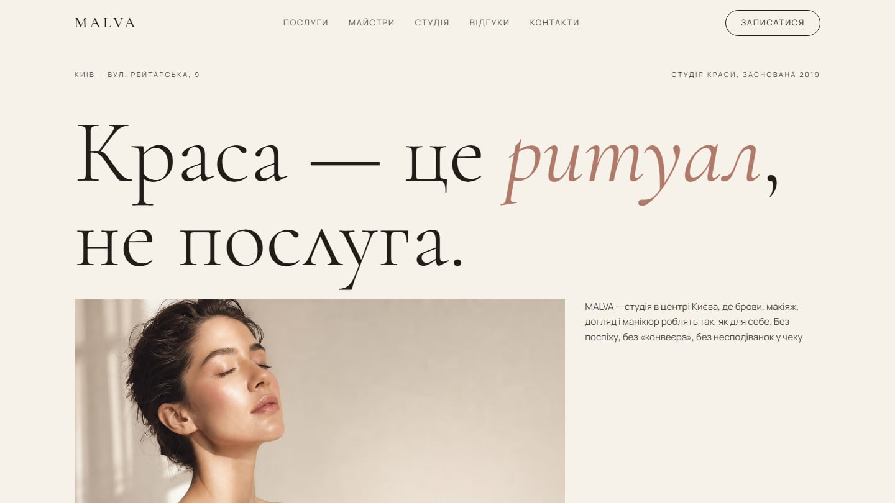
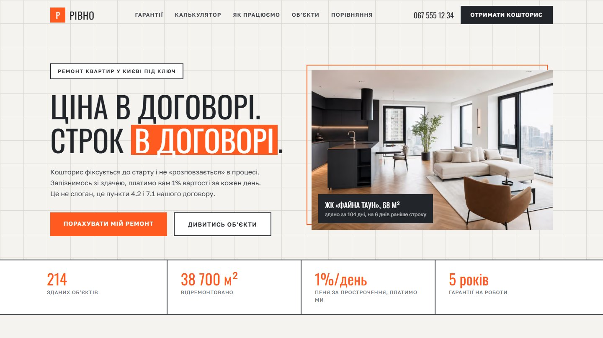
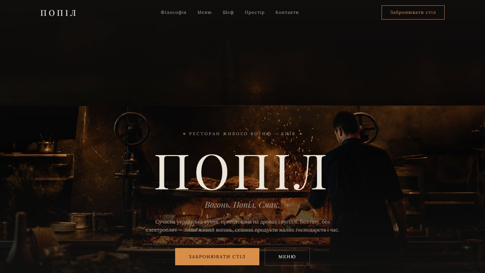

# Selected Local Business Websites

**Category:** Websites / Landing Pages / Conversion UX  
**Source:** Public portfolio repository  
**Role:** Positioning, responsive interfaces, trust signals, booking flows, calculators, service presentation, and bilingual content for five local business websites.  
**Problem:** A local business site has to help one specific customer make one specific decision, which a generic template does not do.  
**Result:** Five live conversion-focused website concepts for Ukrainian local businesses, each built around its own customer decision.  

## Overview

A set of conversion-focused website concepts for Ukrainian local businesses. Each project is designed around a specific customer decision rather than a generic business template.

## Problem & users

The users are the customers of five different local businesses, each facing a different decision:

- KVARC Detailing: which service package is worth the price.
- Emal Dental: whether a first dental appointment feels safe and clear.
- MALVA Beauty: which service, specialist, and time fit, without collecting information through direct messages.
- RIVNO Renovation: whether a renovation company can be trusted with its price, payment stages, and terms.
- POPIL Restaurant: whether the place is right, and a short way to book a table.

## My role & ownership

I designed and built all five sites. The work covers positioning, responsive interfaces, trust signals, booking flows, calculators, service presentation, and bilingual content.

## Product decisions

- KVARC Detailing (kvarc-detailing.vercel.app): built around price clarity and service comparison, with package explanation, a price calculator, a before/after interaction, warranty messaging, and a fast booking path.
- Emal Dental (emal-dental-ten.vercel.app): designed to reduce uncertainty before booking, with doctors, experience, pricing, treatment expectations, and a clear path to an initial appointment.
- MALVA Beauty (malva-beauty-studio.vercel.app): brings services, prices, duration, specialist profiles, studio photos, and booking into one place.
- RIVNO Renovation (rivno-renovation.vercel.app): focused on reducing trust barriers, with estimate logic, staged payment explanation, responsibility terms, comparison content, and a survey request flow.
- POPIL Restaurant (popil-restaurant.vercel.app): focused on atmosphere, concept, menu storytelling, chef positioning, and a short table booking flow.

## System & architecture

`Next.js` `React` `TypeScript` `Tailwind CSS`

The five sites are independent projects, each with its own concept, brand, copywriting, and visuals. They share the same approach: responsive layouts, bilingual content, SEO and structured data setup, and custom client components for calculators, sliders, and booking flows.

## What this demonstrates

- Conversion-focused information architecture
- Responsive website development with bilingual content
- Service business positioning and trust signals
- Booking and lead flows
- Interactive calculators and decision support
