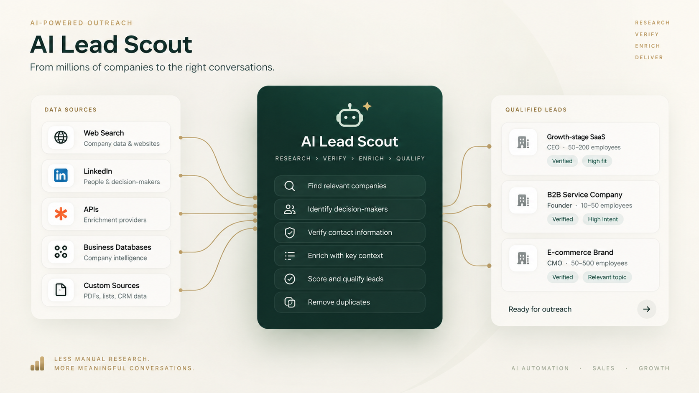

# AI Lead Scout

**Category:** AI-агент / Автоматизація досліджень / Лідогенерація  
**Status:** Активна розробка  
**Source code:** Приватний  
**Role:** Розробка дослідницького агента: оркестрація кампаній, адаптери джерел, верифікація, збагачення даних, оцінювання та тести.  
**Problem:** Інструменти для лідів зупиняються на пошуку, тож кожну компанію, людину й контакт доводиться перевіряти вручну.  
**Result:** У кампанії за Bubble App Gallery збагачено 31 застосунок, із них 27 стали контактними ICP-лідами, а 24 хибні збіги особи відхилено.  
**Metric:** 30 з 31 | застосунків підтверджено як активні  
**Metric:** 23 | з підтвердженим засновником або власником  
**Metric:** 21 | з контактною особою, яка ухвалює рішення  
**Metric:** 23 | з підтвердженим шляхом через LinkedIn  
**Metric:** 27 | класифіковано як контактні ICP-ліди  
**Metric:** 24 | хибних збігів особи відхилено  

## Огляд

AI Lead Scout є дослідницьким агентом, що працює на рівні кампаній і знаходить, перевіряє та збагачує ліди.

Він продовжує пошук між джерелами й пакетами, доки кампанія не отримає потрібну кількість кваліфікованих лідів із контактами або доки не закінчаться доступні джерела.

## Проблема та користувачі

Користувач: той, хто веде кампанію з пошуку лідів і потребує кваліфікованих лідів із контактами. Багато інструментів зупиняються після пошуку: вони повертають компанії або контактні записи, а користувач сам відповідає на найважливіші запитання:

- Чи компанія діюча та релевантна для кампанії?
- Чи це справді та особа, яка ухвалює рішення, і чи надійний збіг ідентичності?
- Чи є робочий спосіб зв'язку та достатньо доказів, щоб писати першим?

AI Lead Scout переносить ці перевірки всередину дослідницького конвеєра.

## Моя роль і відповідальність

Агента створено мною від початку до кінця. Мої зони відповідальності:

- Оркестрація кампаній і стан кампанії
- Адаптери джерел і маршрутизація джерел, зокрема політика витрат
- Верифікація компаній та ідентичності
- Збагачення контактів, оцінювання та усунення дублікатів
- Автоматизовані тести

## Результати продукту та докази

Докази з кампанії за Bubble App Gallery, яка дала 31 унікальний застосунок для збагачення.

## Продуктові рішення

- Кампанії орієнтовані на результат: агент працює, доки не буде досягнуто цілі за кваліфікованими лідами, а не доки завершиться один етап пошуку.
- Консервативна верифікація: самого збігу імені недостатньо, а слабкі чи ризиковані збіги відхиляються, а не пропускаються далі.
- Спершу найдешевше надійне джерело: маршрутизація віддає перевагу офіційним API та прямому доступу перед автоматизацією браузера, провайдерами пошуку й універсальним скрейпінгом.
- Вартість як правило маршрутизації: кампанія може вимагати нульових додаткових витрат або дозволу перед використанням платного провайдера.
- Можливості й вартість розділені: джерело, позначене як технічно доступне, не можна мовчки вважати безкоштовним.

## Система та архітектура

Оркестратор кампаній проводить адаптери окремих джерел через єдиний конвеєр:

1. Розібрати вимоги кампанії та підібрати відповідні джерела.
2. Знайти компанії або продукти-кандидати.
3. Перевірити, що кожна компанія діюча та релевантна.
4. Визначити ймовірну особу, яка ухвалює рішення, і підтвердити її ідентичність доказами.
5. Збагатити контактні канали: LinkedIn, електронну пошту, Instagram, Facebook, телефон або контактні форми.
6. Оцінити відповідність кампанії та якість доказів, відхиляючи слабкі або ризиковані збіги.
7. Прибрати дублікати між джерелами.
8. Продовжувати, доки не досягнуто цілі кампанії або не вичерпано можливості джерел.

`TypeScript` `Playwright` `Exa` `Apify` `Web Research` `Automation` `Data Enrichment`

Маршрутизація джерел віддає перевагу надійному й дешевому доступу та переходить до складніших способів лише за потреби:

1. Офіційний API або кінцева точка з даними
2. Пряме розбирання HTTP-відповідей
3. Локальна автоматизація браузера через Playwright
4. Провайдери пошуку й збагачення, як-от Exa
5. Перевірені Apify Actors для конкретних джерел
6. Універсальні провайдери скрейпінгу, лише коли без них не обійтися

## Ключовий виклик

Відрізнити справжні збіги від хибних. Кандидат не є сильним лише тому, що ім'я схоже, тож агент шукає підтвердження: посаду в компанії, володіння продуктом, історію профілю чи поточну активність.

Хибні збіги ідентичності відхиляються, а не пропускаються мовчки як ліди. У кампанії за Bubble App Gallery під час верифікації відхилено 24 хибні збіги особи.

## Валідація та якість у продакшені

- Автоматизовані тести покривають адаптери джерел, декларації можливостей, поведінку кампаній, політику витрат, збагачення та логіку верифікації.
- Пізніший архітектурний аудит розділив можливості провайдера та додаткову вартість.
- Лід зараховується лише на підставі доказів: верифікація відхиляє слабкі чи ризиковані збіги ще до того, як вони потраплять у результат.

## Результат

У кампанії за Bubble App Gallery збагачено 31 унікальний застосунок: 30 підтверджено як активні, 23 мали підтвердженого засновника або власника, а 27 класифіковано як контактні ICP-ліди. Важливий результат у скороченні від кандидатів до підтверджених, придатних до роботи лідів.

## Що це демонструє

- Оркестрацію агента з кількох джерел із логікою кампаній, орієнтованою на результат
- Верифікацію ідентичності та контактних даних на підставі доказів
- Маршрутизацію джерел із запасними варіантами та виконання з урахуванням вартості
- Усунення дублікатів і стан кампанії
- Розробку агентів через тестування

## Примітка щодо публічності

Робочий вихідний код, облікові дані провайдерів, приватні дані кампаній і закрита логіка верифікації навмисно не включені до цього публічного кейсу.
