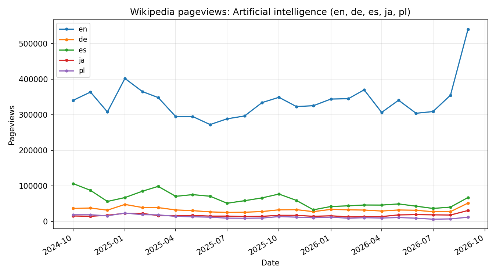
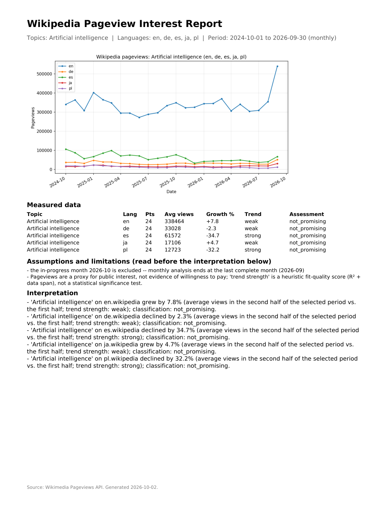

# Wikipedia Pageview Insights

**Category:** Agent Skill для AI / Аналіз даних / Звітність  
**Status:** Завершено  
**Source code:** Публічний  
**Repository:** https://github.com/romanlozynskyi/wikipedia-pageview-insights  
**Role:** Наскрізна розробка Agent Skill: розпізнавання тем, отримання даних, аналіз, графіки, PDF-звіти, тести та перевірка наживо.  
**Problem:** Засновникам потрібен перевірюваний спосіб читати перегляди Вікіпедії як ознаку публічного інтересу за темами, періодами й мовними версіями, не залишаючи розрахунки на розсуд моделі.  
**Result:** Окремий скіл з однією командою CLI, 160 успішними тестами та повним циклом, перевіреним наживо на Claude Haiku 4.5.  
**Metric:** 160 | автоматизованих тестів, усі успішні | evidence | Відповіді Wikimedia замокано, тож набір не потребує мережі, а кілька тестів звертаються до живого API
**Metric:** 3.11 до 3.14 | підтримуваних версій Python | evidence | Закріплені залежності з готовими збірками, перевірено з чистого встановлення на 3.12 і 3.14
**Metric:** 5 | сценаріїв перевірки наживо на Claude Haiku 4.5 | evidence | Невелика недорога модель пройшла повний цикл на реальних даних Wikidata, Вікіпедії та Wikimedia

## Огляд

Wikipedia Pageview Insights є самодостатнім агентським скілом для досліджень на основі джерел, що використовує офіційні дані Wikimedia і Wikidata: він зіставляє теми з правильними статтями, отримує й кешує перегляди, аналізує тренди в коді, створює графіки та PDF-звіт і безпечно зупиняється, коли дані отримати неможливо.

Він допомагає засновникам порівнювати інтерес за періодами та мовними версіями, не залишаючи розрахунки на розсуд моделі, і створений як технічний кейс для Genesis AI Product Engineering School. Я створив його від початку до кінця.

- Розпізнавання тем у мовних версіях, з поверненням неоднозначності користувачеві
- Отримання даних з офіційних API Wikimedia, із кешуванням і ретрансляцією для заблокованих мереж
- Аналіз тренду й зростання за критеріями користувача, потім графіки й односторінковий PDF
- Набір тестів і перевірка наживо на невеликій недорогій моделі

## Результати продукту та докази

Докази надійності, відтворюваності та опори на джерела, а не кількості виходів. Незалежний перерахунок живої серії точно збігся з приростом, нахилом, R-квадратом і загальною кількістю переглядів скіла.

## Ключові продуктові та інженерні рішення

- Лише офіційні джерела: усі дані надходять з офіційного API Wikimedia Pageviews і Wikidata, тож кожна цифра простежується до цих відповідей.
- Детермінований аналіз перед інтерпретацією: розпізнавання назв, математика трендів і зростання, ранжування та текст звіту є детермінованими функціями з модульними тестами, а модель лише читає обчислені поля. Серія з надто малою кількістю даних позначається як недостатні дані, а не як спад.
- Кешування та відтворюваність: дисковий кеш із точним ключем робить повторні запити дешевими, місяць, що триває, ніколи не аналізується, а закріплені залежності тримають середовище відтворюваним.
- Явний needs_data для заблокованих мереж: коли Python не може дістатися до Wikimedia, запуск повертає needs_data з точними офіційними URL API, які агент відкриває власними інструментами й передає назад, замість того щоб завершитися помилкою.
- Жодних вигаданих даних, коли доступу немає: передані відповіді перевіряються й відхиляються, якщо не відповідають запиту, а якщо URL неможливо відкрити, агент зупиняється й повідомляє користувача, а не обходить проблему.

## Система та архітектура

`Python` `Wikimedia API` `Wikidata` `NumPy` `Matplotlib` `ReportLab` `pytest`

Одна команда CLI запускає шестикроковий конвеєр:

1. Розпізнавання: знайти правильну статтю для кожної теми в кожній мовній версії через Wikidata і попросити користувача обрати, коли тема неоднозначна.
2. Отримання: взяти місячні або денні дані переглядів з офіційних API Wikimedia, із затримкою перед повтором за помилок 429 і 5xx. Історія переглядів починається з липня 2015 року.
3. Кеш: зберігати кожну серію за точним ключем і ніколи не кешувати серію, що закінчується в поточному періоді.
4. Аналіз: обчислити суми, середні, зростання, відповідність тренду й позначку сили тренду в коді, потім оцінити кожну серію за власними критеріями користувача.
5. Графік: відобразити серії на графіку.
6. Звіт: створити односторінковий PDF і повний JSON-результат.

Контракт CLI невеликий. Одна команда координує окремі модулі розпізнавання, отримання, аналізу, графіків і звітності. Її JSON-результат містить статус (ok, needs_disambiguation, needs_data або error), обчислені поля та масив обмежень. SKILL.md пояснює агентові, як керувати CLI і як читати цей JSON.

## Валідація та якість у продакшені

- Покриття тестами: 160 автоматизованих тестів, усі успішні, із замоканими відповідями Wikimedia та кількома тестами, що звертаються до живого API.
- Відтворюване середовище: закріплені залежності, підтримка Python 3.11 до 3.14, перевірка з чистого встановлення на 3.12 і 3.14 та димовий тест чистого встановлення.
- Перевірка наживо: повний цикл пройшов на Claude Haiku 4.5 у п'яти сценаріях користувача на реальних даних, а незалежний перерахунок живої серії точно збігся за приростом, нахилом, R-квадратом і загальною кількістю переглядів. Прогін із п'яти повідомлень зайняв десять викликів інструментів і приблизно 67 тис. токенів загалом.
- Поведінка в заблокованій мережі: ретрансляцію needs_data пройшов наскрізно Haiku 4.5, і кожне число точно збіглося з прямим, незаблокованим запуском.
- Неповні місяці та вирівнювання дат: місячні запити вирівнюються до цілих місяців, а місяць, що триває, виключається й зазначається в обмеженнях, тож неповний місяць ніколи не аналізується як повний.
- PDF і запасні шрифти: DejaVu Sans постачається разом, CJK-текст використовує встановлений системний CJK-шрифт, і лише якщо жоден не покриває символ, береться вбудований CID-шрифт.
- Регресійні тести: кожну реальну помилку, знайдену під час тестування (помилку ранжування, помилку кодування, вигадані причинні твердження, прогалину у визначенні проксі), зафіксовано тестом.

## Результат

Wikipedia Pageview Insights перетворює звичайне запитання про інтерес до теми на перевірений аналіз із опорою на джерела, з графіком, односторінковим PDF і повним JSON, і безпечно зупиняється, а не вгадує, коли дані чи особу встановити неможливо.

Що демонструє цей проєкт:

- Надійну інженерію агентів та інструментів навколо єдиного контракту CLI і JSON
- Опору на джерела лише з офіційних даних
- Детерміновані межі: код для фактів, модель для розмови
- Відтворюваність: закріплені залежності, тести чистого встановлення та перехресно перевірені запуски наживо
- Коректну відмову: явний needs_data, неоднозначність, що повертається користувачеві, жодних вигаданих чисел

## Примітка щодо публічності

Вихідний код публічний. Оглядова схема містить ілюстративні цифри, а графік і PDF-звіт на цій сторінці створив сам скіл із живих даних Wikimedia 2 жовтня 2026 року.
