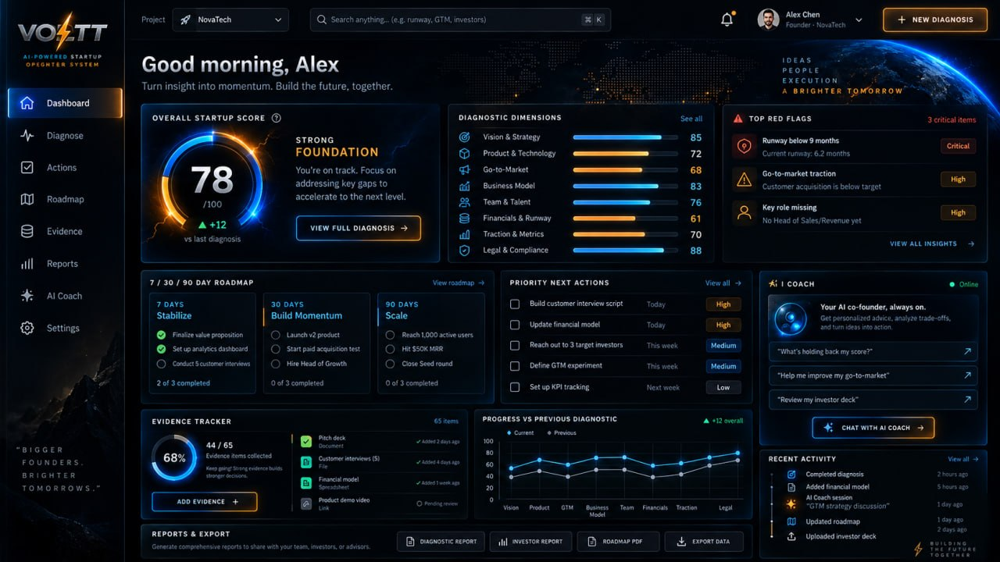

# Voltt

**Category:** Product Rebuild / Startup Platform  
**Status:** In progress  
**Source code:** Private  
**Problem:** The current version reflects short-term prototype decisions, so the rebuild starts from architecture to support product growth.  
**Result:** Rebuild in progress, with an early startup diagnostic dashboard already in place.  

## Overview

Voltt is entering a rebuild phase. The work is being approached architecture-first so the new implementation can support product growth instead of reproducing short-term prototype decisions.

## Problem & users

The users are startup teams assessing their readiness. The product is a startup diagnostic platform, and its current version carries short-term prototype decisions that the rebuild is meant to leave behind.

## Product decisions

- Architecture first: the new implementation is designed to support product growth instead of reproducing prototype shortcuts.

## System & architecture

An early build of the startup diagnostic dashboard is already in place, covering an overall readiness score, per-dimension diagnostics, a 7/30/90-day roadmap, an evidence tracker, and an AI coach panel.

## Outcome

The rebuild is in progress, with an early build of the startup diagnostic dashboard already in place.
